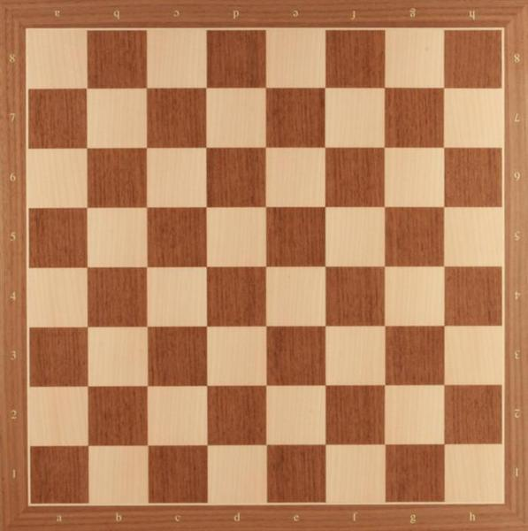
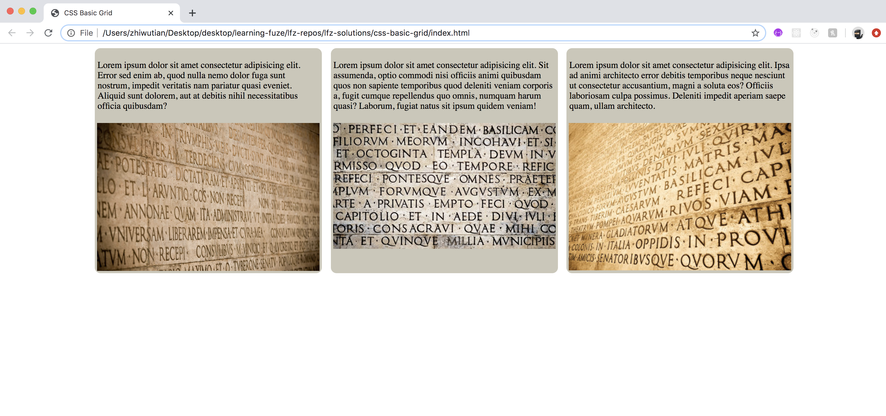

# CSS-Basic-Grid

Using a "grid" system for designing web layouts is a necessity to ensure that a website maintains proper sizing and spatial relationships for the elements whether viewed on a phone, laptop, tv, or computer monitor. This lesson will take you through the process of building a very basic grid system which you will use to create an example three column layout.

### Before You Begin

Be sure to check out a new branch (**from master**) for this exercise. Detailed instructions can be found [**here**](../../guides/before-each-exercise.md).

### Exercise

1. Open the included `index.html` and note the three CSS classes which are included.

2. Each of the three included classes, `container`, `row`, and `column` will perform an important role in the basic grid system you are building. Let's look at each class individually to get more insight into how a grid works.

3. Let's start with the `container` class's place in the `grid` system:
    - The `container` is a fixed size element which will contain child elements and arrange them into `columns` and `rows`.
    - The `container` is fixed in size so that elements contained within its `columns` and `rows` will always fit properly inside the container.
    - Lastly, because the container is fixed in size, `media queries` are needed for responsive designs. Those will be addressed later on.
    - A great way to visualize the `container` of a `grid` system is to imagine that the `container` element is a chess board, and the `columns` and `rows` create the grid pattern of the individual squares.
    - To visualize a `container`, note the example chess board below:
    
4. Now let's look at the `row` class's place in the `grid` system:
    - The `row` is used to contain all of the columns which will sit next to each other on each line.
    - Looking at the chess board above, note that there are eight `rows` which each contain eight `columns` that create an 8 X 8 grid which contains 64 individual squares.
    - So, the row will contain all of the elements which you want to exist on a single horizontal line.
5. The last piece of the `grid` we will look at is the `column` class:
    - The `column` class is used to indicate the width of each of the `columns` contained in each row.
    - Looking again at the chess boards example above, note that each `row` has eight evenly sized `columns`.
    - To relate this to CSS widths, eight evenly spaced `columns` would mean that each `column` is 12.5% wide, which comes from dividing 100 percent of the width by the number of columns (100 / 8 = 12.5).
    - So, every `column` will take up a certain about of width in every `row` as dictated by the needs of the `grid` layout.

6. Now that we are familiar with the components, let's add the needed CSS properties to each class in the included `index.html` file to create a basic `grid` layout.
    - In the `container` class selector:
        - Set the `max-width` property to a value of `1250px` as this is a common and useful size for a full screen `container` and allows for both good content size on full screens and generous gutters.
        - Now, add the `margin` property with the `auto` value so that the container will center itself within the body and give you evenly spaced gutters.
    - In the `row` class selector:
        - Assign the `width` property a value of `100%` to ensure each `row` takes up the full width of the `container`
        - Assign the `display` property a value of `flex` to use `flexbox` for the arrangement of any child elements.
        - Assign the `flex-wrap` property a value of `wrap` which will allow multiple child elements to sit on the same horizontal row with other elements.
    - In the `column` class selector:
        - Assign the `max-width` property a value which will allow three elements to sit next to each other on a single horizontal line.
            - Percentages will be useful here!
        - Make sure to leave a little space for margin between the elements!
    - While a few more lines of CSS will be required to get your output to match the example challenge output, you have created the bulk of it already!

7. Now that your basic grid system is created, create the example output below using the following tips:
    - Your `HTML` will require a `container` element, a `row` element, and three `column` elements.
    - Each `column` will contain two elements, a `p` tag with approx 35 words of lorem ipsum, and an `img` tag with the image source which matches the `column` position, either left, center, or right.
    - You will have to set the `width` of the images in CSS so that they remain contained within their respective elements!
        - Remember that you should not set the `width` and `height` of an image at the same time, as that can adversely affect the aspect ratio of your images!
    - You are welcome to include any additional CSS you want to meet the design goal.
    - Good Luck!!!

### Example

  

### Submitting Your Solution

When your solution is complete, change directories to the root of your lessons repository. Then commit your changes, push, and submit a Pull Request on GitHub. Detailed instructions can be found [**here**](../../guides/after-each-exercise.md).

### Quiz

- Why is it important to use a grid system for CSS layouts?
- What are the three core parts of a grid system?
- Why is it a good idea to use percentages for grid column widths?
