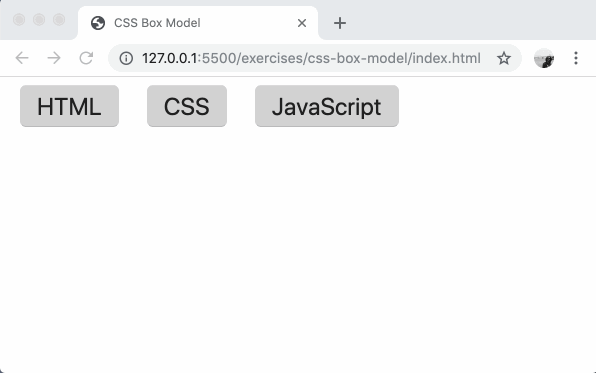

# css-box-model

Controlling basic content layout with the CSS Box Model.

### Before You Begin

Be sure to check out a new branch (**from master**) for this exercise. Detailed instructions can be found [**here**](../../guides/before-each-exercise.md).

### Quiz Questions
After completing this exercise, you should be able to discuss or answer the following questions:

1. What CSS properties make up the box model?
1. Which CSS property pushes boxes away from each other?
1. Which CSS property pushes box content away from its border?

### Exercise

1. Read pages 300-305, 307-314, and 317 in _HTML & CSS_ by Duckett.
1. Bookmark the [MDN Box Model](https://developer.mozilla.org/en-US/docs/Learn/CSS/Introduction_to_CSS/Box_model) reference page and the [MDN `box-sizing`](https://developer.mozilla.org/en-US/docs/Web/CSS/box-sizing) reference page.
1. Bookmark [Paul Irish's blog post](https://www.paulirish.com/2012/box-sizing-border-box-ftw/) about `box-sizing: border-box`.
1. Open `index.html` in your browser.
1. Complete `styles.css` to modify the box model of the buttons on the page. Each button should have:
    - Left and right margin of `12px`
    - Left and right padding of `16px`
    - Top and bottom padding of `6px`
    - Border radius of `6px`

### Before and After Examples

  

### Submitting Your Solution

When your solution is complete, change directories to the root of your lessons repository. Then commit your changes, push, and submit a Pull Request on GitHub. Detailed instructions can be found [**here**](../../guides/after-each-exercise.md).
