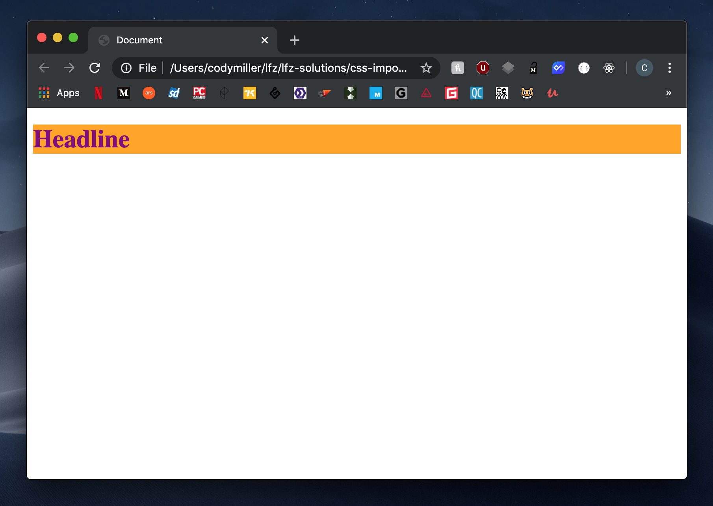

# css-cascade-3

This exercise will introduce you to the third contributing factor to the CSS Cascade: `!important`.

### Before You Begin

Be sure to check out a new branch (**from master**) for this exercise. Detailed instructions can be found [**here**](../../guides/before-each-exercise.md).

### Quiz Questions
After completing this exercise, you should be able to discuss or answer the following questions:

1. What is the purpose of `!important`?
1. When is `!important` a good tool to use?

### Exercise

1. Read the UX Engineer article entitled [Dont Use !important](https://uxengineer.com/css-specificity-avoid-important-css/).
1. Add a `link` tag to the `head` of your `index.html` document that links to your `style.css` stylesheet.
1. Open your `index.html` file in the browser before having written any code, and observe the current state of styling. Notice that some styling already exists in the form of inline styling on the `h1` element.
1. Create a rule-set targeting all `h1` elements, and set their text color to be `purple`, as well as their background color to be `blue`. Open your document in the browser and check if the changes you made have taken effect.
1. In the value for the `color` property you set for `h1` elements in the above step, include `!important` between the current value of `purple` and the semicolon that closes that line. Leave the `background-color` property as-is. Open your document in the browser and observe any changes.
1. When you have completed the exercise, your document should look like the reference image provided below.

  

### Submitting Your Solution

When your solution is complete, change directories to the root of your lessons repository. Then commit your changes, push, and submit a Pull Request on GitHub. Detailed instructions can be found [**here**](../../guides/after-each-exercise.md).
