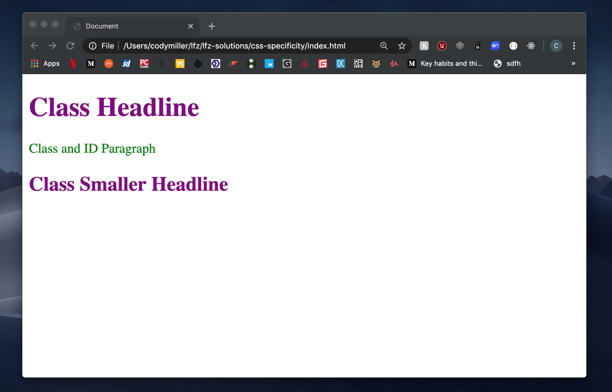

# css-cascade-4

This exercise will introduce you to the fourth and final factor in the CSS Cascade: Specificity.

### Before You Begin

Be sure to check out a new branch (**from master**) for this exercise. Detailed instructions can be found [**here**](../../guides/before-each-exercise.md).

### Exercise

1. Read and bookmark the [MDN explanation of CSS Specificity](https://developer.mozilla.org/en-US/docs/Web/CSS/Specificity).
1. Read and bookmark Estelle Weyl's ["Specifishity" specificity visualization](https://specifishity.com/).

In the `style.css` document, you will be creating a series of CSS rule-sets to target specific elements within the `index.html` document. **Each subsequent rule-set should be placed above the previous rule-set in your stylesheet, in order to show off the power of specificity as it compares to source order**

1. Add a `link` tag to the `head` of your `index.html` document that links to your `style.css` stylesheet.
1. Create a rule-set targeting all elements by using `*`, and set their text color to be `blue`. Open your document in the browser and check if the elements you expected to become blue changed color.
1. Above the previous rule-set in your stylesheet, create a rule-set targeting all `p` elements, and set their text color to be `orange`. Open your document in the browser to observe any changes.
1. Above the previous rule-set in your stylesheet, create a rule-set targeting all elements with a class of `example-class`, and set their text color to be `purple`. Open your document in the browser to observe any changes.
1. Above the previous rule-set in your stylesheet, create a rule-set targeting the element with an id of `exampleId`, and set its text color to be `green`. Open your document in the browser to observe any changes.
1. When you have completed the exercise, your document should look like the reference image provided below.

  

### Submitting Your Solution

When your solution is complete, change directories to the root of your lessons repository. Then commit your changes, push, and submit a Pull Request on GitHub. Detailed instructions can be found [**here**](../../guides/after-each-exercise.md).

### Quiz

- What is specificity?
- How is specificity calculated?
- Why might CSS include this feature?
- What is the order of selector strengths for CSS specificity (commonly referred to as the Specificity Hierarchy)?
- What is the CSS Cascade?
