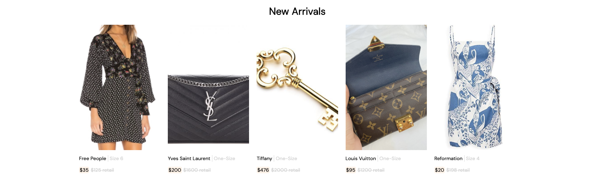

# css-ecommerce-challenge

Using HTML and CSS to build a row of products for sale in a ecommerce application.

### Before You Begin

Be sure to check out a new branch (**from master**) for this exercise. Detailed instructions can be found [**here**](../../guides/before-each-exercise.md).

### Challenge

For this challenge, you will be using HTML and CSS to build a section of an ecommerce site showcasing some products for sale. Your implementation doesn't have to look absolutely identical to the reference image, but get as close as you can. It should be challenging to notice any differences. Product images have been provided in the `assets` folder, along with an `index.html` file including a link element for the "DM Sans" external Google Font. **This font should be used for all text on the page.**

Complete `index.html` and `styles.css` to create a form that looks as close to the following example as possible. You should not need to modify any of the other files.

  

### Workflow

It is recommended that you build your implementation side-by-side with the reference image. Use your browser's developer tools to inspect elements and experiment with styles as you go.

### Useful HTML Elements

Here are **links** to documentation for HTML elements that you may find useful while completing the challenge.

- [`div`](https://developer.mozilla.org/en-US/docs/Web/HTML/Element/div)
- [`h1`](https://developer.mozilla.org/en-US/docs/Web/HTML/Element/Heading_Elements)
- [`p`](https://developer.mozilla.org/en-US/docs/Web/HTML/Element/p)
- [`span`](https://developer.mozilla.org/en-US/docs/Web/HTML/Element/span)
- [`del`](https://developer.mozilla.org/en-US/docs/Web/HTML/Element/del)

### CSS Properties, Selectors, Pseudo-classes, and Pseudo-elements

Here are **links** to some CSS topics that you may find useful while completing the challenge.

#### Properties

- [`width`](https://developer.mozilla.org/en-US/docs/Web/CSS/width)
- [`height`](https://developer.mozilla.org/en-US/docs/Web/CSS/height)
- [`padding`](https://developer.mozilla.org/en-US/docs/Web/CSS/padding)
- [`border`](https://developer.mozilla.org/en-US/docs/Web/CSS/border)
- [`border-color`](https://developer.mozilla.org/en-US/docs/Web/CSS/border-color)
- [`border-radius`](https://developer.mozilla.org/en-US/docs/Web/CSS/border-radius)
- [`margin`](https://developer.mozilla.org/en-US/docs/Web/CSS/margin)
- [`justify-content`](https://developer.mozilla.org/en-US/docs/Web/CSS/justify-content)
- [`align-items`](https://developer.mozilla.org/en-US/docs/Web/CSS/align-items)
- [`font-family`](https://developer.mozilla.org/en-US/docs/Web/CSS/font-family)
- [`font-size`](https://developer.mozilla.org/en-US/docs/Web/CSS/font-size)
- [`text-align`](https://developer.mozilla.org/en-US/docs/Web/CSS/text-align)
- [`color`](https://developer.mozilla.org/en-US/docs/Web/CSS/color)
- [`background-color`](https://developer.mozilla.org/en-US/docs/Web/CSS/background-color)
- [`background-image`](https://developer.mozilla.org/en-US/docs/Web/CSS/background-image)
- [`background-position`](https://developer.mozilla.org/en-US/docs/Web/CSS/background-position)
- [`background-size`](https://developer.mozilla.org/en-US/docs/Web/CSS/background-size)

#### Selectors

- [Type Selector](https://developer.mozilla.org/en-US/docs/Web/CSS/Type_selectors)
- [Class Selector](https://developer.mozilla.org/en-US/docs/Web/CSS/Class_selectors)
- [Descendent Selector](https://developer.mozilla.org/en-US/docs/Web/CSS/Descendant_combinator)
- [Child Selector](https://developer.mozilla.org/en-US/docs/Web/CSS/Child_combinator)

### Submitting Your Solution

When your solution is complete, change directories to the root of your lessons repository. Then commit your changes, push, and submit a Pull Request on GitHub. Detailed instructions can be found [**here**](../../guides/after-each-exercise.md).
