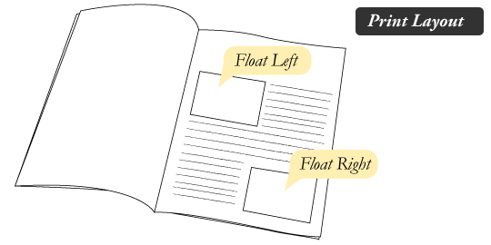
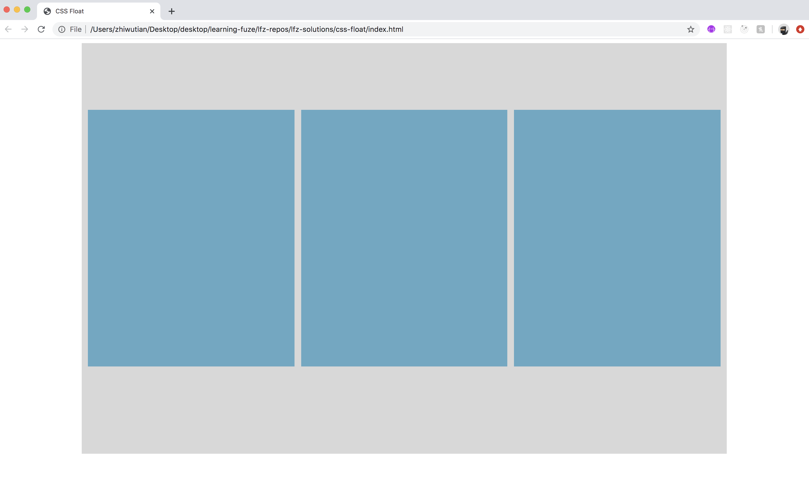

# css-float

Float was originally designed to allow developers to float text around image elements similar to the way newspapers and magazines would display text. For example:

Soon though, developers learned that more than images could be floated. This led to a period of using float in combination with a grid system in order to create complex web layouts. Float was so common that bootstrap 3, one of the most popular CSS libraries in use uses floats as its primary means of controlling web layouts.

Although using floats for layout design has decreased greatly with the advent of newer technologies such as flexbox, it is still important to be familiar with how floats work, as a large part of the internet uses them!

So with that in mind, let's take a look at float!

### Before You Begin

Be sure to check out a new branch (**from master**) for this exercise. Detailed instructions can be found [**here**](../../guides/before-each-exercise.md).

### Quiz Questions
After completing this exercise, you should be able to discuss or answer the following questions:

1. What were floats originally designed for?
1. What are clears for with floats?
1. What are some of the downsides for using floats in layout design?

### Exercise

1. Create an `index.html` file in the `css-float` directory and create a standard HTML skeleton.
2. Read pp. 370 to 376 on Floats in HTML & CSS by Duckett.
3. Open the MDN Documentation on floats [**here**.](https://developer.mozilla.org/en-US/docs/Learn/CSS/CSS_layout/Floats)
4. Using the available resources, use `floats` to create the following example output:

5. Use the following information to help you:
    - The width of the main container element is 80% of the body's width.
    - The main container is centered within the body.
    - The main container has a height of 800px.
    - The main container has a background color of #d8d8d8.
    - The 3 child elements have a width of 32% which allows for some margin to space them apart
    - The 3 child elements have a height of 500px.
    - The child elements have a background color of #65a8c4.
6. When you have completed the exercise, be sure to include a screen shot of your output with your pull request!

### Submitting Your Solution

When your solution is complete, change directories to the root of your lessons repository. Then commit your changes, push, and submit a Pull Request on GitHub. Detailed instructions can be found [**here**](../../guides/after-each-exercise.md).
