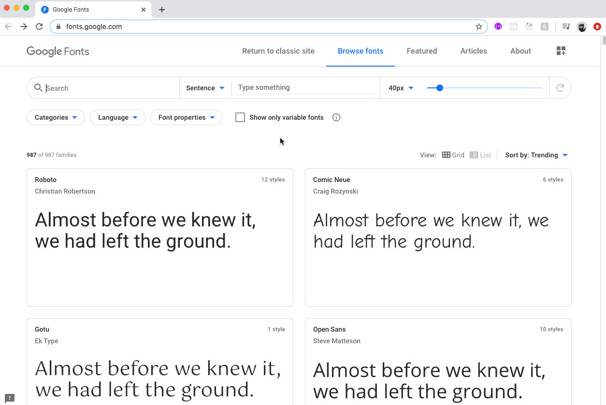

# css-fonts

Using CSS to customize the typeface of an HTML document.

### Before You Begin

Be sure to check out a new branch (**from master**) for this exercise. Detailed instructions can be found [**here**](../../guides/before-each-exercise.md).

### Quiz Questions
After completing this exercise, you should be able to discuss or answer the following questions:

1. What are three important considerations for choosing fonts?
1. Why must you have backup fonts assigned when selecting custom fonts?

### Exercise

1. Read about typeface in pages 264-270 of _HTML & CSS_ by Duckett.
1. Read about `font-family` and `font-size` in pages 273-276 and 279-284 of _HTML & CSS_ by Duckett.
1. Visit [Google Fonts](https://fonts.google.com) and choose two fonts to customize the text in `index.html`. Copy the `<link>` tag provided by Google Fonts and add it to the `<head>` of `index.html`. See the **gif** below for an example of how to get the `<link>` tag.
1. In `styles.css`, set the [`font-family`](https://www.w3schools.com/cssref/pr_font_font-family.asp) CSS property to use your custom fonts for the body and headings. See the image below for an example of custom fonts used to style the page.
1. Use the [`line-height`](https://www.w3schools.com/cssref/pr_dim_line-height.asp) CSS property to add some vertical space between the lines of text in the body.

### Getting the Fonts

  

### Example

  

### Submitting Your Solution

When your solution is complete, change directories to the root of your lessons repository. Then commit your changes, push, and submit a Pull Request on GitHub. Detailed instructions can be found [**here**](../../guides/after-each-exercise.md).
