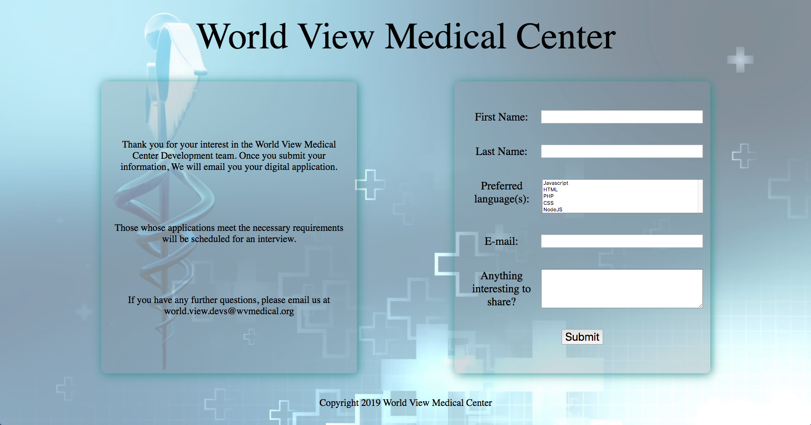

# css-form-challenge

The purpose of this layout challenge is to enhance your ability to build out a web page based on a supplied graphic. In addition, you will be practicing your implementation of HTML forms which are an integral part of web design.

### Before You Begin

Be sure to check out a new branch (**from master**) for this exercise. Detailed instructions can be found [**here**](../../guides/before-each-exercise.md).

### Quiz Questions
After completing this exercise, you should be able to discuss or answer the following questions:

1. How do you align the form inputs?
1. How many containers does this form require?
1. What are some of the pros of using flexbox and the grid system in this layout?
1. How do you submit the form data to the supplied URL?

### Exercise

1. For this challenge, you will be using HTML and CSS to build a custom form from scratch. Your implementation doesn't have to look absolutely identical to the reference image, but get as close as you can. It should be challenging to notice any differences.

1. You will have to create any `HTML` or `CSS` files you feel are necessary.
    - The background image is included in the `images` folder.

1. It is recommended that this form is built using a `grid` system and `flexbox`, as that is what was used to build the solution.
    - The grid system you used in `css-basic-grid` would be very helpful here!
    - [**Here**](https://webdesign.tutsplus.com/tutorials/building-responsive-forms-with-flexbox--cms-26767) is some very useful information on building forms using `flexbox`.

1. Remember to use Google when you get stuck on something!!!
Being able to look up solutions online is a very important skill to develop!

1. The Url to submit form data to  on submit is: http://lfzprototypes.com/forms/world-view-medical-center

1. The method for the above URL is "get".

### Example

  

### Submitting Your Solution

When your solution is complete, change directories to the root of your lessons repository. Then commit your changes, push, and submit a Pull Request on GitHub. Detailed instructions can be found [**here**](../../guides/after-each-exercise.md).
