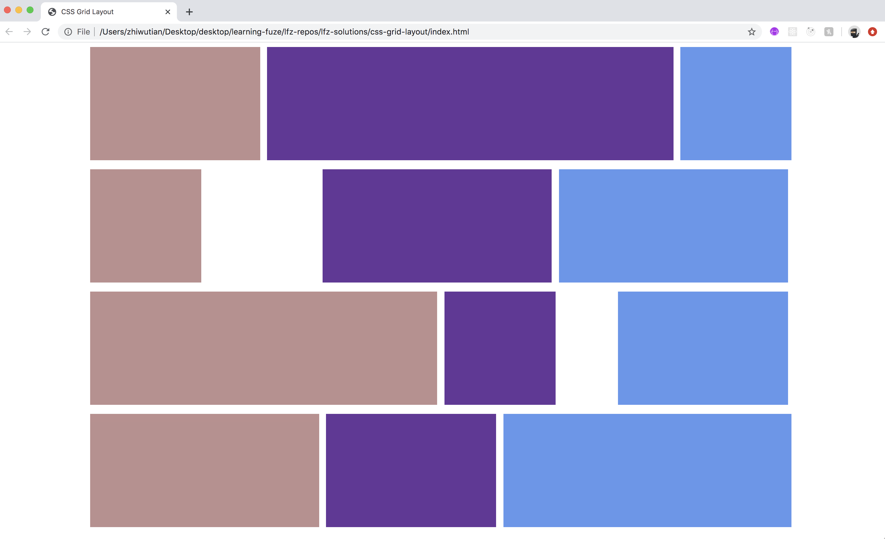
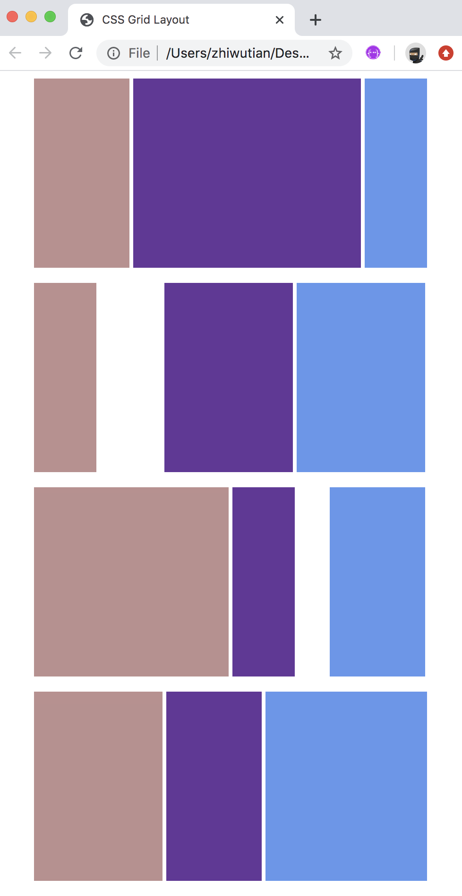

# css-grid-layout

Now that you have created a very simple grid system and are familiar with the components, namely `containers`, `rows`, and `columns`, It is time to recreate an example grid layout using a slightly more robust grid system. This will be very important practice for being able to create a grid layout based on a supplied image.

### Before You Begin

Be sure to check out a new branch (**from master**) for this exercise. Detailed instructions can be found [**here**](../../guides/before-each-exercise.md).

### Quiz Questions
After completing this exercise, you should be able to discuss or answer the following questions:

1. How do you think building this layout would be different without a grid system?
1. What advantages do you see with using a grid system?
1. Why are media queries crucial to responsive grid designs?

### Exercise

1. First note the following about your grid system components:
    - The `container` class:
        - The container class creates a fixed size element which
        is used to contain the rows and columns of a grid layout.
    - The `row` class:
        - The row class creates an element which is used to contain
        all of the elements of an individual row. For Example: a 3 X 3
        grid would contain 3 rows of 3 elements each.
    - The `column` classes:
        - The column classes are used to dictate how much space in each row
        is taken up by the individual elements.
    - The `offset` classes:
        - The offset classes allow you to add margin to the left side of an element in order to allow content to start at any point within the row, or to add additional space between elements in a row.
    - The `media queries`:
        - The media queries below will automatically adjust the set width of the container class depending on the size of the current browser window.
    - This information and more is included in the `grid.css` file to make sure you have all the necessary information available to successfully implement and `understand` your grid system! Make sure to read it!!!

1. Now, open the included `grid.css` file to familiarize yourself with the grid system you will be using:
    - Make sure to read the comments!
    - Understanding the parts of a Grid system is the core of this whole exercise!

1. Now that you are familiar with the supplied grid system, look at the examples below:
    - Grid layout on a full screen
    
    - Grid layout on a 500px wide screen
    
1. Using the supplied `index.html` file, recreate the example layout above. Note that the `grid.css` file has already been linked into the `index.html` file so that you have access to each of the grid classes.
1. Note the following information when building the grid:
    - The grid will be created using a single container element
    - The container element will contain 4 rows, each with 3 column elements.
    - Each row will have a total of 12 columns, and can be any combination of columns and offsets which equal 12.
    - Offsets will be used in rows 3 and 4 to create the whitespace which is present in the example.
    - The height of each column element in the example is 200 pixels.
    - The background color for the first column elements is `rosybrown`, `rebeccapurple` is the color for the second column elements, and the third column element color is `cornflower` blue.
1. Be sure to include two screenshots with your submission:
    - One on a full size screen
    - One on a 500px wide screen

### Submitting Your Solution

When your solution is complete, change directories to the root of your lessons repository. Then commit your changes, push, and submit a Pull Request on GitHub. Detailed instructions can be found [**here**](../../guides/after-each-exercise.md).
