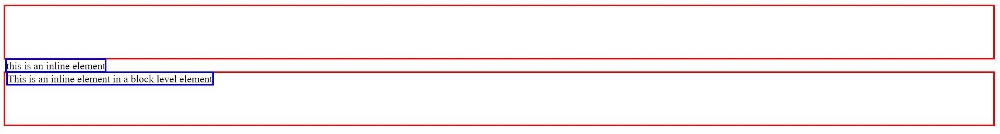

# css-inline-block

Using the CSS `display` properties to affect placement of elements on DOM.

### Before You Begin

Be sure to check out a new branch (**from master**) for this exercise. Detailed instructions can be found [**here**](../../guides/before-each-exercise.md).

### Introduction

1. Read about inline, block, and inline-block on page 317 of _HTML & CSS_ by Duckett.

1. Open `index.html` and take a moment to look over the css properties between the style tags.

### Display Block

1. Create a `
` element with a class of `block-element`

1. Open `index.html` in your browser.

1. Hover over the `
` in your inspector.  We did not specify a width and yet it takes up the entire width of the browser.  We added a border to make the differences more visible.

    

    
    

### Display Inline

1. Create a `
` element with a class of `inline-element`

1. Add the following text node to the `
`.
    `This is an inline element.`

1. Hover over the `
` in your inspector.  Try to add a width and a height to the inline `
` in your inspector.  Notice how it only takes up as much as its content needs.  But does not respond to width and or height.

    

    
    

1. Create a `
` element with a class of `block-element`.
1. Inside the `
` element with a class of `block-element`, add a `
` element with a class of `inline-element`.
1. Add the following text node inside the `
` element with a class of `inline-element`.
    `This is an inline element in a block level element.`

    

    
    

### Display Inline Block

1. Create two `
` elements with a class of `inline-block-element`.
1. Open your inspector and play around with the size of your screen, notice how each element interacts with size changes differently.

    

    
    

    `Inline Block` is a combination of `Inline` and `Block`, which is what allows the two divs to sit side by side.

### Exercise

1. Create a `navbar.html` and add a basic [HTML Skeleton](../html-skeleton/README.md).

1. Add a `<style>` tag in the appropriate area.

1. Build the following web page in `navbar.html` by creating [List Elements](../html-lists/README.md).

    

    
    

1. Add the correct `display` property in the `<style>` tag to create the following example.

    

    
    

### Submitting Your Solution

When your solution is complete, change directories to the root of your lessons repository. Then commit your changes, push, and submit a Pull Request on GitHub. Detailed instructions can be found [**here**](../../guides/after-each-exercise.md).

### Quiz

- Why did we not add `display: block` property to the `
`?
- What is the difference between `display: none` and `visibility: hidden`?
- What is the difference between `block` and `inline block`?
