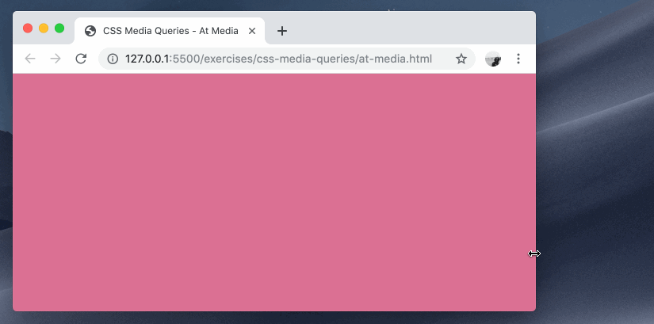
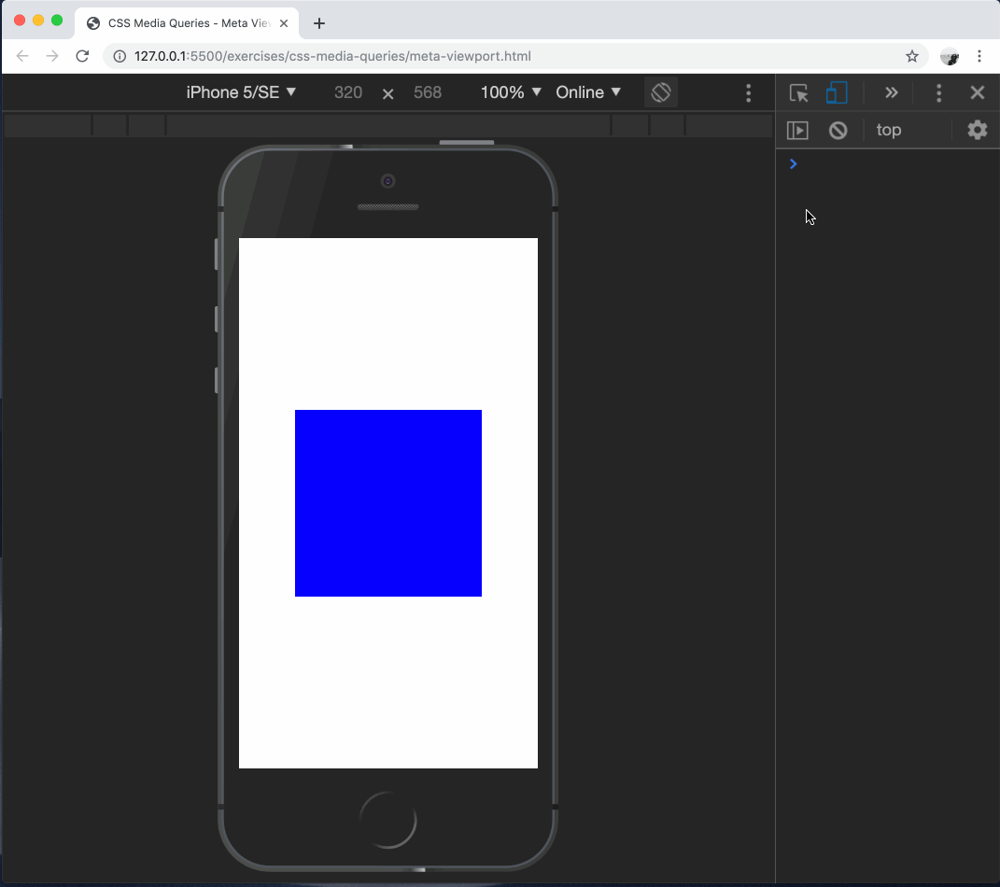

# css-media-queries

Conditionally applying styles to a document based on media type and features.

### Before You Begin

Be sure to check out a new branch (**from master**) for this exercise. Detailed instructions can be found [**here**](../../guides/before-each-exercise.md).

#### Introduction

1. Read the introduction to [Responsive Web Design](https://en.wikipedia.org/wiki/Responsive_web_design) on Wikipedia.
1. Bookmark the [9 basic principles of responsive web design](https://blog.froont.com/9-basic-principles-of-responsive-web-design/).

#### CSS `@media` at-rule

1. Read about the CSS `@media` at-rule [in the MDN Web Docs](https://developer.mozilla.org/en-US/docs/Web/CSS/@media).
1. Read about the CSS `width` media feature [in the MDN Web Docs](https://developer.mozilla.org/en-US/docs/Web/CSS/@media/width).
1. Complete the styles in `at-media.html` to make the `background-color` of the `body` change from `palevioletred` to `papayawhip` when the browser window is at least `768px` wide.

  

#### Breakpoints

1. Bookmark the CSS-Tricks list of [Media Queries for Standard Devices](https://css-tricks.com/snippets/css/media-queries-for-standard-devices/).
1. Bookmark the guide to [Using Media Queries](https://developer.mozilla.org/en-US/docs/Web/CSS/Media_Queries/Using_media_queries) in the MDN Web Docs.
1. Complete the styles in `breakpoints.html` to change the `flex-basis` of `.card-container` to:
    - `50%` for screens wider than `575px`
    - one third (`calc(100% / 3)`) for screens wider than `767px`

  

#### `<meta name="viewport">`

1. Read the **Background** and **Viewport basics** sections of the [Viewport Meta Tag](https://developer.mozilla.org/en-US/docs/Mozilla/Mobile/Viewport_meta_tag) article in the MDN Web Docs.
1. Open `meta-viewport.html` in your browser and open the Developer Tools.
1. Enable [Device Mode](https://developers.google.com/web/tools/chrome-devtools/device-mode/) and choose an mobile phone device type.
1. Complete the markup of `meta-viewport.html` so that the media queries therein change the `background-color` of the `.box` from `blue` to `red` when the screen is at least `568px` wide.

  

### Submitting Your Solution

When your solution is complete, change directories to the root of your lessons repository. Then commit your changes, push, and submit a Pull Request on GitHub. Detailed instructions can be found [**here**](../../guides/after-each-exercise.md).

### Quiz

- Give two examples of media features that you can query in an `@media` rule.
- Which HTML meta tag is used in mobile-responsive web pages?
