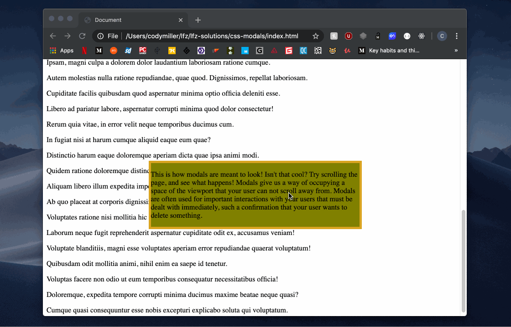

# css-modals

Creating an element which can overlay all other content of the DOM.

### Before You Begin

Be sure to check out a new branch (**from master**) for this exercise. Detailed instructions can be found [**here**](../../guides/before-each-exercise.md).

### Quiz Questions
After completing this exercise, you should be able to discuss or answer the following questions:

1. What is a modal?
1. What are some use cases for modals?
1. Why does a modal usually need to occupy the entire height and width of the viewport?

### Exercise

1. Read the introduction to [Modal window](https://en.wikipedia.org/wiki/Modal_window) on Wikipedia.
1. Read the section entitled "What is a Modal Box?" in [Modal and Modeless Boxes in Web Design](https://webdesign.tutsplus.com/articles/modal-and-modeless-boxes-in-web-design--webdesign-2282). You are welcome to read more if you'd like, but only the first section will be necessary for this exercise.
1. Bookmark the [MDN position](https://developer.mozilla.org/en-US/docs/Web/CSS/position) documentation, and read **ONLY** the section entitled "Fixed positioning".
1. Open the provided `index.html` document in your `css-modals` folder through VSCode. You'll notice that there are already a selection of paragraph tags filled with lorem ipsum. Above these, there is an element at the top of the `body` with a class of `modal-overlay`, which has a child div with a class of `modal-content`. In this exercise, we will be providing CSS styling to these two elements in order to create a modal for our document. **You will not need to make any changes to your `index.html` file, your stylesheet has already been linked for you.**
1. Open the provided `style.css` document with VSCode.
1. Create a CSS rule-set targeting any elements with a class of `modal-overlay`. This element's purpose is to act as a wrapper for the contents of our modal. As such, we need it to accomplish a few set goals:
    - Position itself in a space above the document flow.
    - Set the available area of the viewport it will work within.
    - Set the position of the modal contents within it.
1. Within the rule-set for elements with a class of `modal-overlay`, please do the following:
    - Set the `position` property to have a value of `fixed`, in order to make it position itself above the document flow.
    - Set the `top` property to have a value of `0`. This will make the element appear at the top of the available area, which will be the top of the viewport.
    - Set the `display` property to have a value of `flex`. This will make any elements this rule-set matches into Flexbox elements.
    - Set the `justify-content` property to have a value of `center`. This will set any child elements to be centered horizontally.
    - Set the `align-items` property to have a value of `center`. This will set any child elements to be centered vertically.
    - Set the `height` property to have a value of `100vh`. This will ensure that the modal overlay takes up the entire viewport's height.
    - Set the `width` property to have a value of `100%`. This will ensure that the modal overlay takes up the entire viewport's width.
1. Beneath your rule-set targeting elements with a class of `modal-overlay`, create another rule-set targeting elements with a class of `modal-content`. This element will serve the purpose of the content of our modal. For the sake of this exercise, we are simply going to apply some cosmetic changes to the element to make it stand out from the background.
1. Within the rule-set for elements with a class of `modal-content`, please do the following:
    - Set the background color to `olive`.
    - Set the element to have a `solid` border with a thickness of `5px` and a color of `goldenrod`. Use the [border shorthand property](https://developer.mozilla.org/en-US/docs/Web/CSS/border) in order to accomplish this.
    - Set the `width` of the element to `50%`.
1. Open your `index.html` document. If you have completed the exercise successfully, your document should look and act the same way as the below gif.

### Example

  

### Submitting Your Solution

When your solution is complete, change directories to the root of your lessons repository. Then commit your changes, push, and submit a Pull Request on GitHub. Detailed instructions can be found [**here**](../../guides/after-each-exercise.md).
