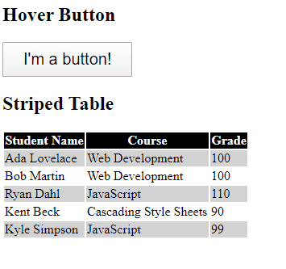

# css-pseudo-classes

Using CSS to modify the style of elements based on state or position.

### Before You Begin

Be sure to check out a new branch (**from master**) for this exercise. Detailed instructions can be found [**here**](../../guides/before-each-exercise.md).

### Quiz Questions
After completing this exercise, you should be able to discuss or answer the following questions:

1. What are CSS pseudo-classes useful for?

### Exercise

1. Read about the `:hover`, `:active`, and `:focus` pseudo-classes on page 291 of _HTML & CSS_ by Duckett.
1. Read and bookmark the [MDN Index of pseudo-classes](https://developer.mozilla.org/en-US/docs/Web/CSS/Pseudo-classes).
1. Write code in `index.html` and `styles.css` to make a big button that changes colors and the user's cursor when they hover over it.
1. Read about the [`:nth-child()` pseudo-class on MDN](https://developer.mozilla.org/en-US/docs/Web/CSS/:nth-child) and [on w3schools](https://www.w3schools.com/cssref/sel_nth-child.asp).
1. Write more code in `index.html` and `styles.css` to make a **striped** table of five "student grades".

### Example

  

### Submitting Your Solution

When your solution is complete, change directories to the root of your lessons repository. Then commit your changes, push, and submit a Pull Request on GitHub. Detailed instructions can be found [**here**](../../guides/after-each-exercise.md).
