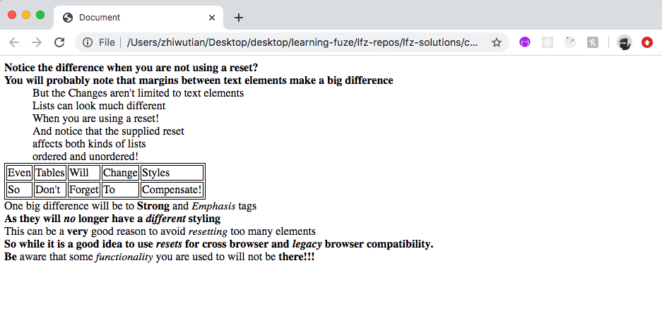

# css-resets

The use of a CSS Reset is tied to responsive and predictable CSS layouts. The reason for this is that every web browser has slightly different default styling behavior for HTML elements, and unless a reset it used, your layouts will not always respond in the expected manner. In this exercise, you will be creating a simple CSS reset to gain some insight into how they work and what considerations you should take into account when creating or using other CSS resets.

### Before You Begin

Be sure to check out a new branch (**from master**) for this exercise. Detailed instructions can be found [**here**](../../guides/before-each-exercise.md).

### Quiz Questions
After completing this exercise, you should be able to discuss or answer the following questions:

1. Why are CSS resets helpful for cross browser compatibility?
1. Why is it important to be mindful of what you reset with your CSS resets?
1. What is an argument against using CSS resets?

### Exercise

1. Read this Article about why we use resets [**here**](https://bitsofco.de/a-look-at-css-resets-in-2018/)
1. Check out the famous Eric Meyer reset [**here**](https://meyerweb.com/eric/tools/css/reset/)
1. Now, open the included `index.html` file in VS-Code:
    - Note the HTML structure and each of the tags used. How do you expect the page to look in the browser when the page is opened?
    - Also, note the CSS which has been commented out. You will recognize it as Meyer's CSS Reset.
1. Now, open the `index.html` file in the browser and examine the output. Does it match your expectations?
1. Next, uncomment the Meyer CSS Reset code in the `index.html` file and refresh the browser tab.
1. Did you expect such a drastic change? It's very important when using CSS Resets to remember how much default styling exists for HTML elements within the `user agent stylesheets`.
1. Now that you have seen what a CSS Reset can do, it is time to create your own.
1. Delete the Meyer Reset from the `index.html` page, and replace it with one which performs the following:
    - Changes the font size of all text elements to `1rem`
    - Removes any default `margin` from those same text elements.
    - Removes the number and dot markers from the lists.
    - Removes any default `margin` from the lists.

        - Exmaple output with correct reset:

1. When you have completed your reset and your output matches the example output above, move on to the `Submitting You Solution` section below!

### Submitting Your Solution

When your solution is complete, change directories to the root of your lessons repository. Then commit your changes, push, and submit a Pull Request on GitHub. Detailed instructions can be found [**here**](../../guides/after-each-exercise.md).
