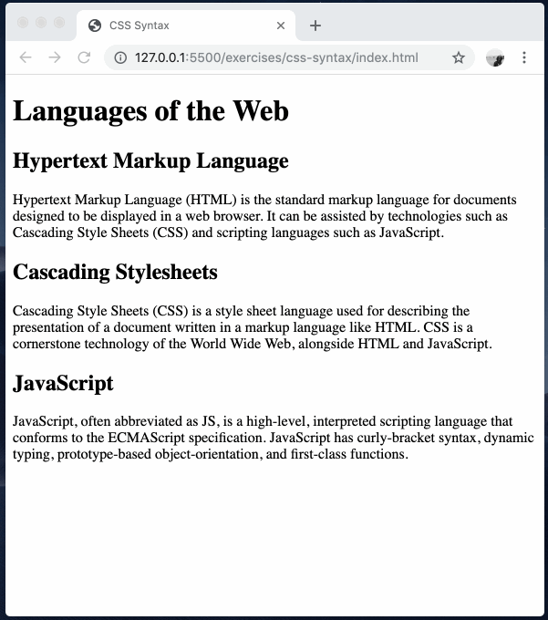

# css-syntax

Exploring the syntax of style sheets.

### Before You Begin

Be sure to check out a new branch (**from master**) for this exercise. Detailed instructions can be found [**here**](../../guides/before-each-exercise.md).

### Exercise

1. Read about CSS syntax in pages 226-244 in _HTML & CSS_ by Duckett. Pay especially close attention to page 238.
1. Bookmark the [MDN CSS Syntax](https://developer.mozilla.org/en-US/docs/Web/CSS/Syntax) reference page.
1. Bookmark the [MDN CSS Selectors](https://developer.mozilla.org/en-US/docs/Web/CSS/CSS_Selectors) reference page.
1. Create a new CSS file named `styles.css` and link it to `index.html` with a `<link>` tag within `index.html`'s `<head>` element.
   > `<link rel="stylesheet" href="styles.css">`
1. Within `styles.css`, create CSS rules to accomplish the following:
   - Select the `body` and give it a `color` of `#090302 and a `font-family` of `sans-serif`.
   - Select the `h1` and give it a `text-align` of `center`.
   - Select all `article` elements and give them:
     - A `padding-left` and `padding-right` of `16px`.
     - A `border` of `1px solid`.
     - A `border-radius` of `6px`.
     - A `margin-bottom` of `16px`.
   - Select all elements with the `class` attribute of `"title"` and give them a `font-family` of `monospace` and a `font-size` of `24px`.
   - Select the heading with the `id` attribute of `"html"` and give it the `color` of `red`.
   - Select the heading with the `id` attribute of `"css"` and give it the `color` of `green`.
   - Select the heading with the `id` attribute of `"js"` and give it the `color` of `blue`.

### Before and After Examples

  

### Submitting Your Solution

When your solution is complete, change directories to the root of your lessons repository. Then commit your changes, push, and submit a Pull Request on GitHub. Detailed instructions can be found [**here**](../../guides/after-each-exercise.md).

### Quiz

- What are the names of the individual pieces of a CSS rule?
