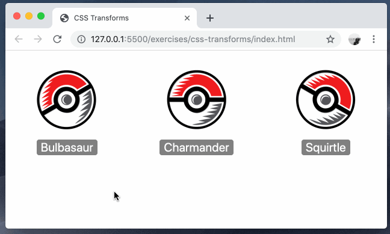

# css-transforms

Using the CSS `transform` property to modify the rotation or position of HTML elements.

### Before You Begin

Be sure to check out a new branch (**from master**) for this exercise. Detailed instructions can be found [**here**](../../guides/before-each-exercise.md).

### Exercise

1. Read about the `rotate()` transform in the [CSS Tricks Almanac](https://css-tricks.com/almanac/properties/t/transform/#article-header-id-2).
1. Review [`:first-child`](https://developer.mozilla.org/en-US/docs/Web/CSS/:first-child), [`:last-child`](https://developer.mozilla.org/en-US/docs/Web/CSS/:last-child), and [the child selector](https://developer.mozilla.org/en-US/docs/Web/CSS/Child_combinator) in the MDN Web Docs.
1. Update `styles.css` to rotate the pokéball image in the first column counter clockwise by 30 degrees and the pokéball image in the last column clockwise by 30 degrees. **You are free to modify the `index.html` in this step but it is encouraged to attempt to use a pseudo selector to complete the step.**
1. Read about the `translate()` transform in the [CSS Tricks Almanac](https://css-tricks.com/almanac/properties/t/transform/#article-header-id-3).
1. Review the [`:active`](https://developer.mozilla.org/en-US/docs/Web/CSS/:active) pseudo-class in the MDN Web Docs.
1. Update `styles.css` to translate each button down the page by `0.25rem` when the user is clicking on it. **Do not modify the `index.html` file to complete this step!**

### Example

  

### Submitting Your Solution

When your solution is complete, change directories to the root of your lessons repository. Then commit your changes, push, and submit a Pull Request on GitHub. Detailed instructions can be found [**here**](../../guides/after-each-exercise.md).

### Quiz

- What does the transform property do?
- What is the difference between the `:first-child` pseudo selector and the `:last-child` pseudo selector?
