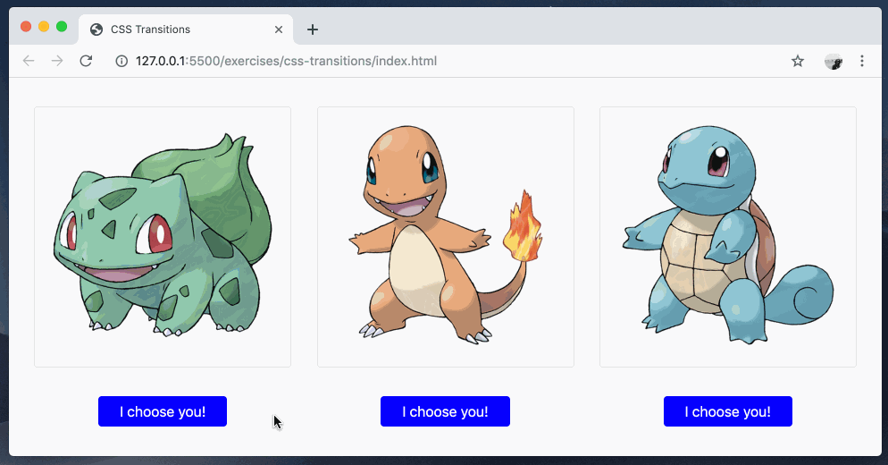

# css-transitions

Using CSS to animate between user interface states.

### Before You Begin

Be sure to check out a new branch (**from master**) for this exercise. Detailed instructions can be found [**here**](../../guides/before-each-exercise.md).

### Exercise

1. Read about the CSS `transition` property in the [CSS Tricks Almanac](https://css-tricks.com/almanac/properties/t/transition/).
1. Open the MDN documentation on the `:hover` pseudo-class [**here**](https://developer.mozilla.org/en-US/docs/Web/CSS/:hover).
1. Bookmark the [MDN CSS transition](https://developer.mozilla.org/en-US/docs/Web/CSS/transition) reference page.
1. Modify the code in `styles.css` to complete the following:
    - Each button's `background-color` should transition from `blue` to `red` when the user hovers their mouse over it.
      - The transition for the background-color during mouse hover should take 0.5 seconds.
    - Each card's [`scale` transform](https://developer.mozilla.org/en-US/docs/Web/CSS/transform-function/scale) should transition from `1` to `1.1` when the user hovers their mouse over it.
      - The transition for the scale during mouse hover should be 0.6 seconds.

### Example

  

### Submitting Your Solution

When your solution is complete, change directories to the root of your lessons repository. Then commit your changes, push, and submit a Pull Request on GitHub. Detailed instructions can be found [**here**](../../guides/after-each-exercise.md).
