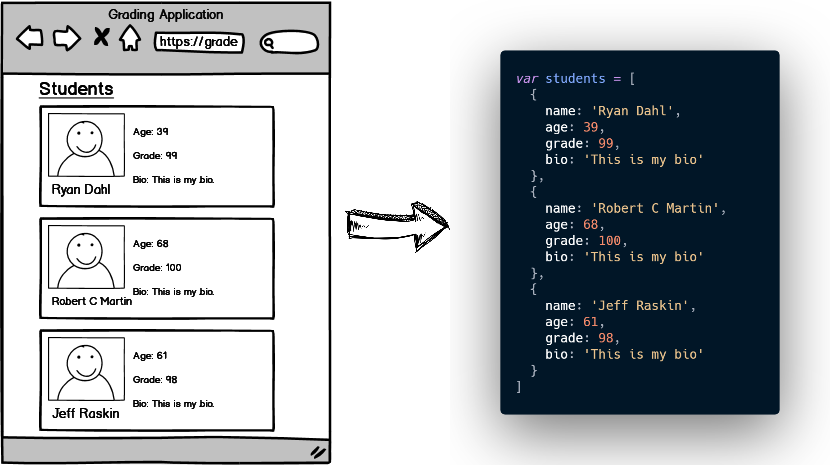
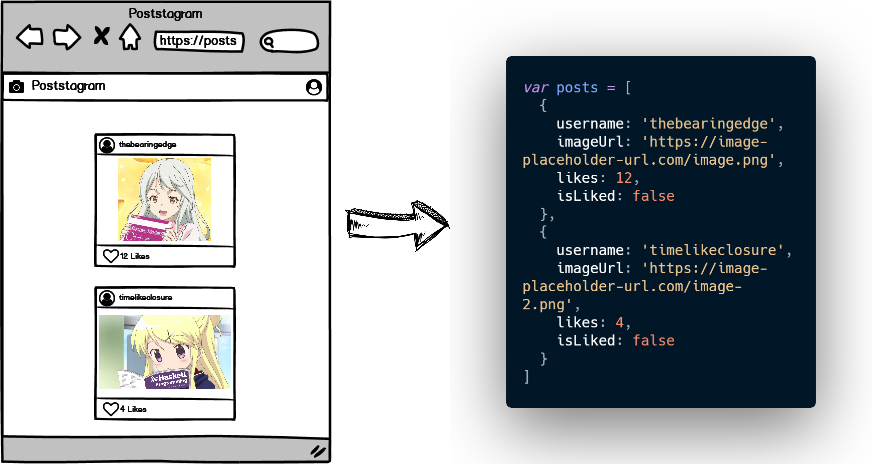
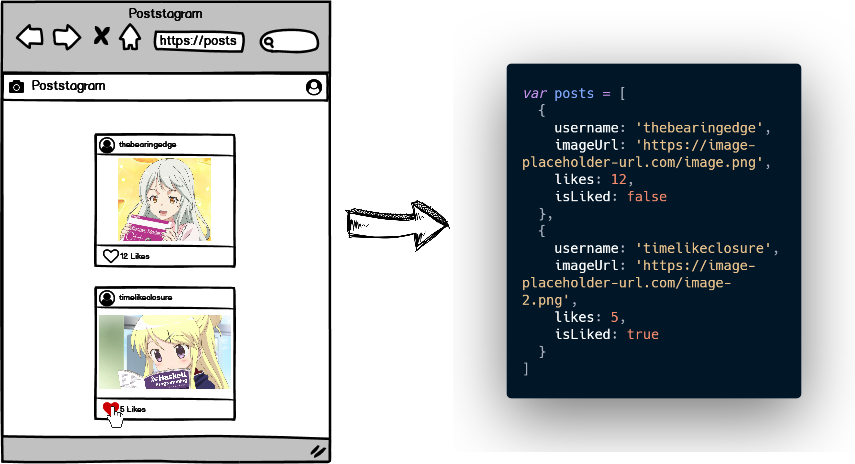

# data-modeling-1

### What is Data Modeling?

When you are using an application anywhere on the web, you're likely interacting with someone sort of Data Model.  It is the source of truth in your application.  Lets take a look at an example.

  

The array of objects is our Data Model.  Every object in the array represents a piece of the model that we must dynamically create a visual representation for.  Anything you see on the DOM that requires any form of outside data should be backed up by some form of data in our model.

This pattern leaves us with a source of truth. Many new developers start off with the DOM being the source of truth which is a terrible practice.  Your DOM should be the output of your data, and **if there are any changes to the DOM created by your user,  they must be reflected in the data model as well.**  Lets see another example.

  

Here we have a an example similar to above.  But in this case we are also keeping track of our users input and not just displaying data.  Let's take a look at what should happen if the user were to like the image.

  

As you can see, when the user clicks the heart, the likes are incremented, and the boolean flag `isLiked` is set to true.  Which will let us update the DOM to have a red heart as well.  There are various frameworks that accomplish that task for us, but at this stage it is best for you to accomplish this using JavaScript alone.

Now that we have the overview of what data modeling is, we can get in to the challenge.

### Before You Begin

Be sure to check out a new branch (**from master**) for this exercise. Detailed instructions can be found [**here**](../../guides/before-each-exercise.md).

### Quiz Questions
After completing this exercise, you should be able to discuss or answer the following questions:

1. Why do we need a single source of truth?

### Challenge

Have a look at your `index.html` file in the browser.  You will see the following:

  

Your task is to convert this visual representation of the DOM into a JavaScript object to the best of your ability.  Feel free to look at the code in your `index.html` file to see what would make sense to store as data.

To clarify, your job is not to do any dom manipulation or creation, only to create a data model of the dom in its current state.

### Submitting Your Solution

When your solution is complete, change directories to the root of your lessons repository. Then commit your changes, push, and submit a Pull Request on GitHub. Detailed instructions can be found [**here**](../../guides/after-each-exercise.md).
