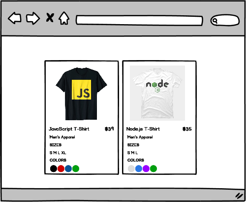

# data-modeling-2

### Before You Begin

Be sure to check out a new branch (**from master**) for this exercise. Detailed instructions can be found [**here**](../../guides/before-each-exercise.md).

### Quiz Questions
After completing this exercise, you should be able to discuss or answer the following questions:

1. Why would I create a function to generate my DOM Element instead of just writing my code in the global scope?

### Challenge

Have a look at your `main.js` file.

The `products` array will be used as your data model in this challenge. Your challenge is to render each object onto the `DOM` **using JavaScript**.

Here is the expected output.

  

Define a function that takes an object and returns a `DOM Tree`.  Using that function, insert your elements into the document.

Feel free to style the product card how ever you like.

### Submitting Your Solution

When your solution is complete, change directories to the root of your lessons repository. Then commit your changes, push, and submit a Pull Request on GitHub. Detailed instructions can be found [**here**](../../guides/after-each-exercise.md).

### Bonus Challenge

**Reminder: Please only attempt this part after you have already submitted the first solution.**

Your bonus task is to render the data model on the DOM to match the solution below

  

  
  

