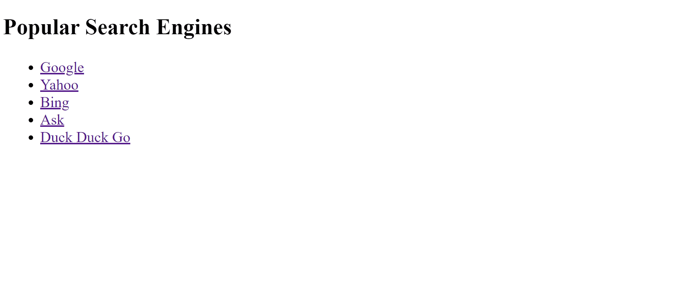

# html-anchor-tags

Using HTML anchor tags to link to other HTML documents or websites.

### Before You Begin

Be sure to check out a new branch (**from master**) for this exercise. Detailed instructions can be found [**here**](../../guides/before-each-exercise.md).

### Exercise
1. Read about HTML Links in pages 74-80 of _HTML & CSS_ by Duckett.
1. Review the example web page gif below.
1. Create an `index.html` and add a basic [HTML Skeleton](../html-skeleton/README.md).
1. Build the following web page in `index.html` by creating an unordered list using list elements.  If you are having trouble creating the list elements please refer back to the previous exercise [here](../html-lists/README.md).

    

      
    

1.  After creating your unordered list add anchor tags to recreate the output below.

    

      
    

### Bonus Challenge - do _after_ turning in the above

Have all your links open in a new window.

Read page 86 of _HTML & CSS_ by Duckett for more information.

### Submitting Your Solution

When your solution is complete, change directories to the root of your lessons repository. Then commit your changes, push, and submit a Pull Request on GitHub. Detailed instructions can be found [**here**](../../guides/after-each-exercise.md).

### Quiz

- What is an absolute URL?
- What is a relative URL?
- What other ways can we use an anchor tag?
