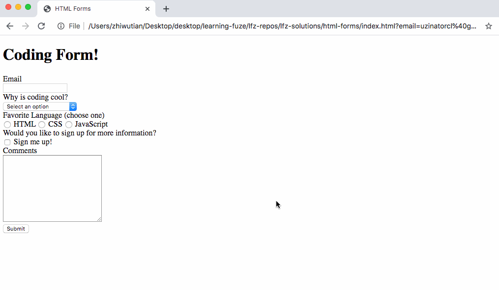

# html-forms

Now that you have seen the `MDN` first form and have a better idea of how forms work and how they are structured, it is time for more exposure to the available form `input` types.

In the following exercise, you will be creating a form which will be used to collect student information.

Let's get started!

### Before You Begin

Be sure to check out a new branch (**from master**) for this exercise. Detailed instructions can be found [**here**](../../guides/before-each-exercise.md).

### Quiz Questions
After completing this exercise, you should be able to discuss or answer the following questions:

1. What is the purpose of an HTML form element?
1. Give five examples of form control elements.
1. Give three examples of `type` attributes for HTML `<input>` elements.

### Exercise

1. Read about HTML forms in pages 144-164 and 170-174 in _HTML & CSS_ by Duckett.
1. Bookmark the [HTML Input](https://developer.mozilla.org/en-US/docs/Web/HTML/Element/input) and [HTML Form](https://developer.mozilla.org/en-US/docs/Web/HTML/Element/form) reference pages in the MDN Web Docs.
1. Review the example web page gif below.

    

      
    

1. Create an `index.html` file in the `html-forms` directory with a basic HTML skeleton.

1. Within `index.html`, build the HTML form depicted in the gif using the following information.
    - You will note in `Duckett` that they use `
` tags and ` ` tags within their forms for formatting and spacing purposes, and while this is not "wrong" it is better in modern programming to use `
`s and add some CSS for formatting. Remember, `HTML` tags should not be used in modern development to adjust styling, that is what CSS is for!
      - With the above in mind, you do not need to use `CSS` in this exercise, it is fine that the inputs are close to each other! Just be sure to avoid using `
` and ` ` tags for formatting in this form!
    - Each input must have an associated `label` with a proper `for` attribute which matches the `input`'s `id` attribute.
    - The dropdown input has four different choices:
      - Select an option
      - Because it's interesting
      - Because it's fun
      - Because it's powerful
1. When you have completed the above and your form is functioning correctly, move on to the `Submitting Your Solution` below.

### Submitting Your Solution

When your solution is complete, change directories to the root of your lessons repository. Then commit your changes, push, and submit a Pull Request on GitHub. Detailed instructions can be found [**here**](../../guides/after-each-exercise.md).

