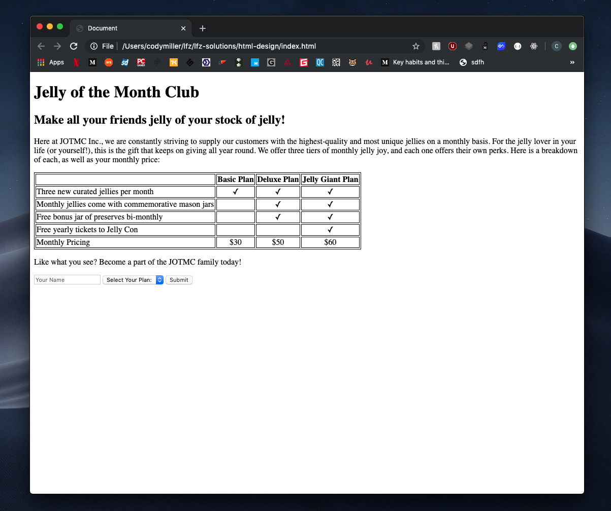
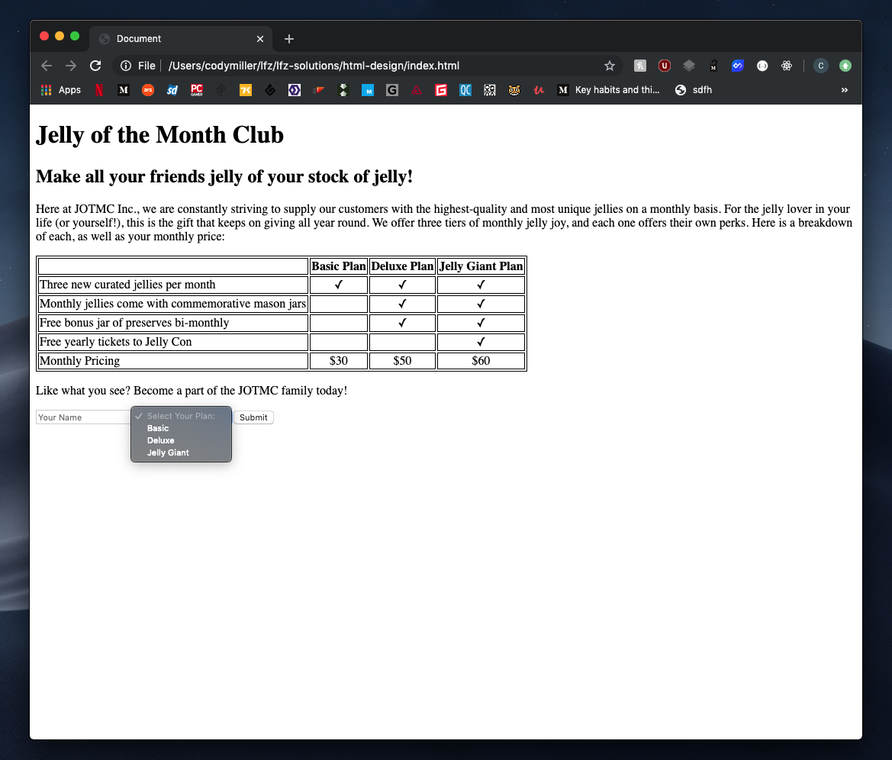

# html-layout-design

Choosing the right type of HTML element for your layout based on purpose and proper structure of your document.

### Before You Begin

Be sure to check out a new branch (**from master**) for this exercise. Detailed instructions can be found [**here**](../../guides/before-each-exercise.md).

### Quiz Questions
After completing this exercise, you should be able to discuss or answer the following questions:

1. Why would we choose specific element types when we have elements such as `div` and `span` which can be used for anything?
1. What factors contribute to a well-designed HTML document?

### Exercise

1. Review the following documentation prior to beginning the exercise:
    - [HTML Input Types](https://developer.mozilla.org/en-US/docs/Web/HTML/Element/input)
    - [HTML Select](https://developer.mozilla.org/en-US/docs/Web/HTML/Element/select)
    - [HTML Option](https://developer.mozilla.org/en-US/docs/Web/HTML/Element/option)
    - [HTML Semantics](https://developer.mozilla.org/en-US/docs/Glossary/Semantics)
1. Review the example web page screenshot below.
1. Create an `index.html` and add a basic [HTML Skeleton](../html-skeleton/README.md).
1. Build the following web page in `index.html` by choosing an appropriate type of HTML element for each portion of the page. As you are deciding upon the layout design for your version, consider the following factors:
    - Possible uses for HTML5 semantic elements.
    - Proper structure for HTML tables.
    - Proper structure for HTML forms.
    - HTML tables do not have borders by default.
        - For the sake of this exercise, you may use the HTML [`border` attribute](https://www.w3schools.com/tags/att_table_border.asp) to give your table a border. **NOTE:** This method of applying a border is now deprecated. Going forward, you will use CSS to accomplish this task.
    - The button within your form should be able to submit the form.
    - Formatting is just as important as choosing the right type of element!

##### Example layout

  

##### Example layout with `select` element focused

  

### Submitting Your Solution

When your solution is complete, change directories to the root of your lessons repository. Then commit your changes, push, and submit a Pull Request on GitHub. Detailed instructions can be found [**here**](../../guides/after-each-exercise.md).
