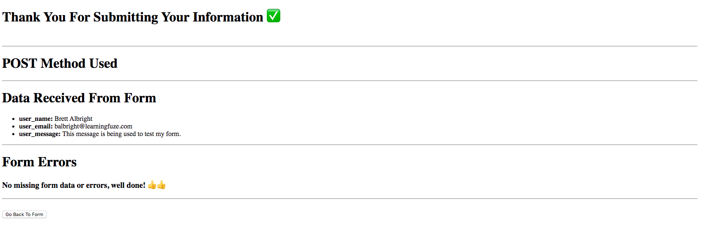

# html-mdn-form

HTML forms are an integral part of web development. Their ability to receive data and send it to outside computer systems, specifically computer servers, makes them indispensible to developers. Forms also have a large amount of functionality built in to them, and that functionality requires that you understand that parts which make up a form.

The First form you are going to create will be based on the MDN `Your First Form` documentation, and will display not only your understanding of basic forms, but your ability to read and follow documentation.

So with that in mind, let's get started!

### Before You Begin

Be sure to check out a new branch (**from master**) for this exercise. Detailed instructions can be found [**here**](../../guides/before-each-exercise.md).

### Quiz Questions
After completing this exercise, you should be able to discuss or answer the following questions:

1. Why are forms useful?
1. What attribute do you have to match between a `label` and an `input`?
1. What type of input allows you to select multiple items in a dropdown?
1. What is the `action` of a form?

### Exercise

1. First, create an `index.html` file in the html-mdn-form directory, and create a basic HTML skeleton.
2. Now, open the MDN `Your first form` documentation [**here**.](https://developer.mozilla.org/en-US/docs/Learn/Forms/Your_first_form)
3. Follow along with the documentation, and build the form it describes.
4. Use the following information to complete your form's functionality:
    - action: https://lfzprototypes.com/forms/contact-us
    - Method: post
5. Example output once form is working correctly:

5. When you have completed the above and your form is working as expected, don't forget to include a screenshot with your pull request!

### Submitting Your Solution

When your solution is complete, change directories to the root of your lessons repository. Then commit your changes, push, and submit a Pull Request on GitHub. Detailed instructions can be found [**here**](../../guides/after-each-exercise.md).
