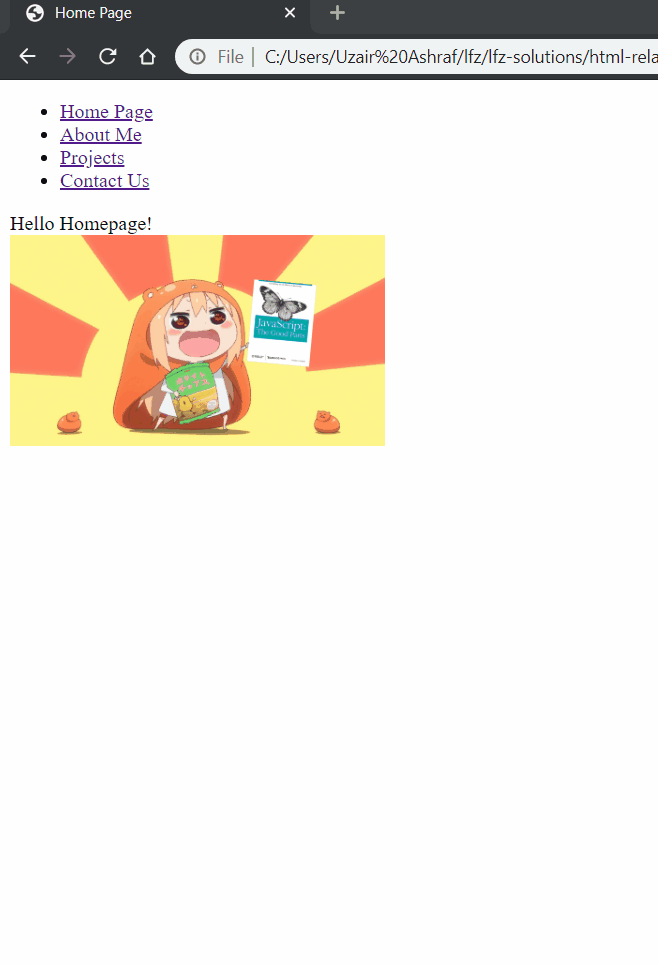

# html-relative-pathing

When it comes to navigating through multiple HTML files, or incorporating images into your websites, understanding the structure and use of relative paths is essential. The reason for this is that organizing multiple HTML files and images often requires using many different files in separate folders, and these multiple files and folders require you as the developer to connect the various files and assets together.

In the following exercise, you will be creating the needed relative paths to connect four different HTML pages and their image assets together via `<a>` tags.

Let's get started!

### Before You Begin

Be sure to check out a new branch (**from master**) for this exercise. Detailed instructions can be found [**here**](../../guides/before-each-exercise.md).

### Quiz Questions
After completing this exercise, you should be able to discuss or answer the following questions:

1. How do you indicate the parent folder in a path?
1. How do you indicate the child folder in a path?
1. How do you indicate the grand parent folder in a path?
1. How do you indicate the current folder in a path?

### Exercise

1. Read about HTML Relative Urls in pages 82-84 of _HTML & CSS_ by Duckett.
2. Open, bookmark, and familiarize yourself with the `Using paths & folders` documentation [**here**](https://learn-the-web.algonquindesign.ca/topics/paths-folders/).
3. Review the example web page gif below.
    - Note that there are four links on each of the `HTML` pages which route to each of the other pages.
    - Note also that each page has an associated image which you will need to integrate into the associated `HTML` page.
4. With the above in mind, modify the existing html documents to link the following web pages to each other by adding [anchor tags](../html-anchor-tags/README.md) and relative paths.

    - `index.html`
    - `about-me.html`
    - `contact-us.html`
    - `projects.html`
      - Remember, each page will require you to create four links, one for each of the `HTML` pages.
      - You should be able to link to any page from any page once the exercise is complete.

5.  Finally, add the paths for the images to the `src` attributes of the img tags

  

6. When the above is complete, and your links are correctly navigating to the proper pages and images are loading, move on to the `Submitting Your Solution` section below.

### Submitting Your Solution

When your solution is complete, change directories to the root of your lessons repository. Then commit your changes, push, and submit a Pull Request on GitHub. Detailed instructions can be found [**here**](../../guides/after-each-exercise.md).
