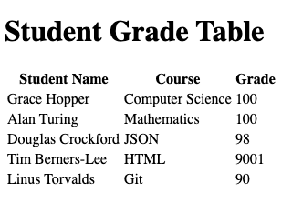

# html-tables

Displaying tabular data in HTML pages.

### Before You Begin

Be sure to check out a new branch (**from master**) for this exercise. Detailed instructions can be found [**here**](../../guides/before-each-exercise.md).

### Quiz Questions
After completing this exercise, you should be able to discuss or answer the following questions:

1. What are the six primary HTML elements for creating tables?
1. What purpose do the `thead` and `tbody` elements serve?
1. Give two examples of data that would lend itself well to being displayed in a table.

### Exercise

1. Read about HTML tables in pages 126-132 and 135-136 in _HTML & CSS_ by Duckett.
1. Read the MDN documentation on the [`thead` element](https://developer.mozilla.org/en-US/docs/Web/HTML/Element/thead).
1. Read the MDN documentation on the [`tbody` element](https://developer.mozilla.org/en-US/docs/Web/HTML/Element/tbody).
1. Bookmark the MDN documentation [HTML table basics](https://developer.mozilla.org/en-US/docs/Learn/HTML/Tables/Basics).
1. Review the example web page screenshot below.
1. Create an `index.html` and add a basic [HTML Skeleton](../html-skeleton/README.md).
1. Within `index.html`, build the HTML table depicted below.

  

### Submitting Your Solution

When your solution is complete, change directories to the root of your lessons repository. Then commit your changes, push, and submit a Pull Request on GitHub. Detailed instructions can be found [**here**](../../guides/after-each-exercise.md).
