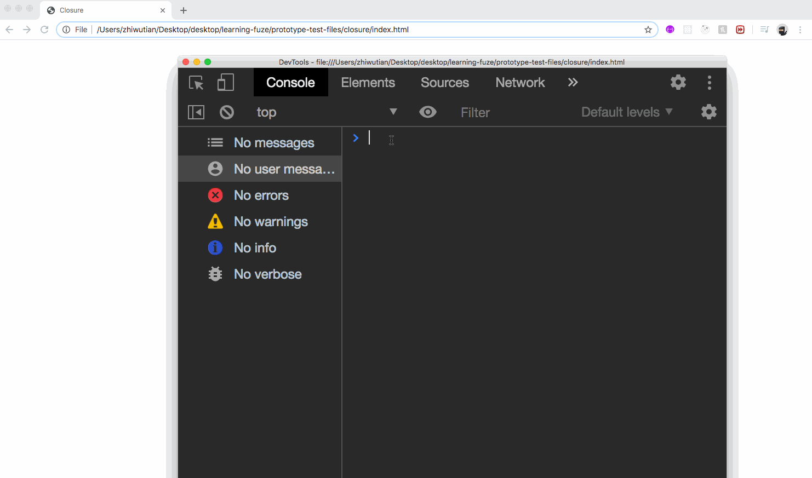
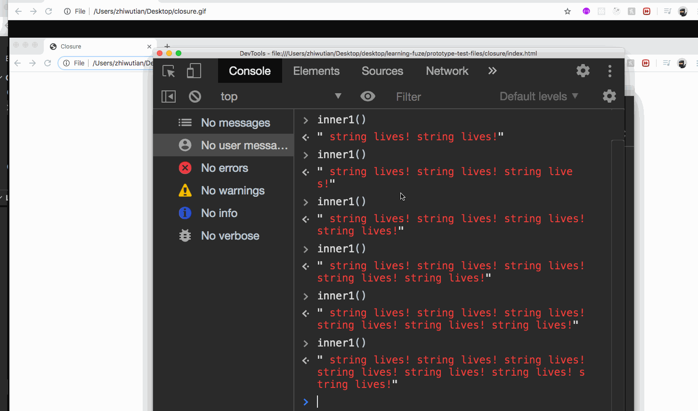

# javascript-closures

An introduction to closures in JavaScript

### Before You Begin

Be sure to check out a new branch (**from master**) for this exercise. Detailed instructions can be found [**here**](../../guides/before-each-exercise.md).

### Quiz Questions
After completing this exercise, you should be able to discuss or answer the following questions:

1. What is a closure in JavaScript?
1. What does it mean to say that JavaScript functions have lexical scope?

### Exercise

1. Read `A simple guide to help you understand closures in JavaScript` by Prashant Ram [**here**](https://medium.com/@prashantramnyc/javascript-closures-simplified-d0d23fa06ba4)
1. Now, create an `index.html` and `main.js` file and prepare them for running JavaScript code.
1. In the main.js file do the following:
    - Create a function named `outer` which has a local variable named `string` assigned an empty string,  and a nested function named `inner` which is returned when the `outer` function is called
    - Within the `inner` function, concatenate the string value `string Lives!` to the string variable of the outer function, and return the string variable
    - Now, call the outer function in the `global` space and save the return value in a variable named `inner1`.
    - When the above is completed, check your console for the following functionality:
    

    - When the functionality above is working, `console.dir` the `inner1` function and find the closure in the console.

    

1. When your functionality is complete and you can visualize the closure in the console, move on to the `Submitting Your Solution` section below!

### Submitting Your Solution

When your solution is complete, change directories to the root of your lessons repository. Then commit your changes, push, and submit a Pull Request on GitHub. Detailed instructions can be found [**here**](../../guides/after-each-exercise.md).
