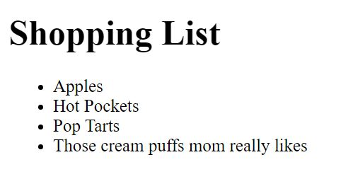
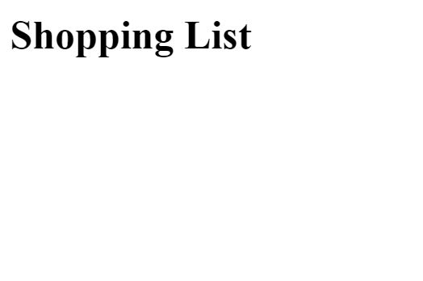

# javascript-dom-creation-1

In this exercise you are going to use vanilla javascript to create elements and manipulate the DOM.  All the HTML elements in this exercise are only allowed to be created using vanilla JavaScript.


### Before You Begin

Be sure to check out a new branch (**from master**) for this exercise. Detailed instructions can be found [**here**](../../guides/before-each-exercise.md).

### Quiz Questions
After completing this exercise, you should be able to discuss or answer the following questions:

1. What are two ways to target elements on the DOM?
1. What is another way to add a text node to an element other than using **textContent**.
1. How do you create a HTML element using vanilla Javascript?


### Exercise

1. Read about DOM creation in 223 and 224 in _JavaScript and jQuery_ by Duckett.
1. Create an `index.html` and add a basic [HTML Skeleton](../html-skeleton/README.md).

1. Add a `<script>` tag at bottom of your `<body>` tag like so:

    ```html
      <body>
      <!-- your html goes here -->


      <script>
      //your javascript code goes here
      </script>
      </body>
    ```

    You may also create a `main.js` file and link it your `index.html` using a `<script>` tag.  However it must be linked at the bottom of the `<body>`.

1. Take a look at the example screenshot below:

    <p align="center">
      
    </p>

    **Reminder:**

    **The goal of this exercise is to reach the example above using only vanilla javascript.  So please understand when I say things like _Create an `<h1>` HTML element_ in this exercise, I mean using vanilla JavaScript.**

1.  Here are some links to documentation that can help you with this exercise:

    [querySelector](https://developer.mozilla.org/en-US/docs/Web/API/Document/querySelector#Examples)

    [createElement](https://developer.mozilla.org/en-US/docs/Web/API/Document/createElement)

    [appendChild](https://developer.mozilla.org/en-US/docs/Web/API/ParentNode/append#Examples)

    [textContent](https://developer.mozilla.org/en-US/docs/Web/API/Node/textContent)

1. Create an `<h1>` HTML element.

1. Add the following text node to the `<h1>` element:
    ```
    Shopping List
    ```
1. Append the `<h1>` element to the `<body>`.

    <p align="center">
      
    </p>

1. Create a `<ul>` HTML element.  This element will be used as the parent for your shopping list items.

1. Create four `<li>` HTML elements.  Add text nodes to each element.  You can follow the example's shopping list items or use your own.

1.  Append the four `<li>` HTML elements to the `<ul>` HTML element.

1.  Append the `<ul>` HTML element to the body.


    <p align="center">
      
    </p>

### Submitting Your Solution

When your solution is complete, change directories to the root of your lessons repository. Then commit your changes, push, and submit a Pull Request on GitHub. Detailed instructions can be found [**here**](../../guides/after-each-exercise.md).
