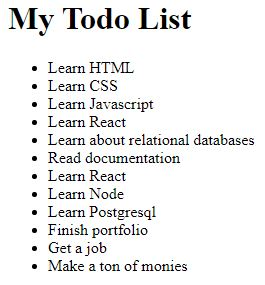
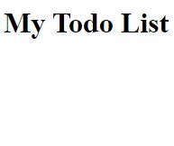

# javascript-dom-creation-2

In this exercise you are going to use vanilla javascript to create elements and manipulate the DOM.  All the HTML elements in this exercise are only allowed to be created using vanilla JavaScript.


### Before You Begin

Be sure to check out a new branch (**from master**) for this exercise. Detailed instructions can be found [**here**](../../guides/before-each-exercise.md).

### Quiz Questions
After completing this exercise, you should be able to discuss or answer the following questions:

1. Why is using loops and arrays for creating multiple dom elements preferable to creating them one at a time?
1. Why are arrays preferred over objects for the functionality referenced in question 1?

### Exercise

1. There is no reading material in this exercise, it uses the same concepts you learned in your last exercise along with a couple more challenging tasks.  If you would like a refresher please read about DOM creation on pages 223 and 224 in _JavaScript and jQuery_ by Duckett.
1. Create an `index.html` and add a basic [HTML Skeleton](../html-skeleton/README.md).

1. Add a `<script>` tag at bottom of your `<body>` tag like so:

    ```html
      <body>
      <!-- your html goes here -->


      <script>
      //your javascript code goes here
      </script>
      </body>
    ```

    You may also create a `main.js` file and link it your `index.html` using a `<script>` tag.  However it must be linked at the bottom of the `<body>`.

1. Take a look at the example screenshot below:

    <p align="center">
      
    </p>

    **Reminder:**

    **The goal of this exercise is to reach the example above using only vanilla javascript.  So please understand when I say things like _Create an `<h1>` HTML element_ in this exercise, I mean using vanilla JavaScript.**

1.  Here are some links to documentation that can help you with this exercise:

    [querySelector](https://developer.mozilla.org/en-US/docs/Web/API/Document/querySelector#Examples)

    [createElement](https://developer.mozilla.org/en-US/docs/Web/API/Document/createElement)

    [appendChild](https://developer.mozilla.org/en-US/docs/Web/API/ParentNode/append#Examples)

    [textContent](https://developer.mozilla.org/en-US/docs/Web/API/Node/textContent)

    [for loop](https://developer.mozilla.org/en-US/docs/Web/JavaScript/Reference/Statements/for)

1. Create an `<h1>` HTML element.

1. Add the following text node to the `<h1>` element:
    ```
    My Todo List
    ```
1. Append the `<h1>` element to the `<body>`.

    <p align="center">
      
    </p>

1. Create a `<ul>` HTML element.  This element will be used as the parent for your todo list items.

1. Create an **array literal** named `todoItemsArray` with a minimum of ten values.  Each value should be a string representing something you would add to your todo list.  If you are having trouble thinking of ten things to add to your array feel free to copy the ones in the example below:

    ```javascript
      "Learn HTML",
      "Learn CSS",
      "Learn Javascript",
      "Learn React",
      "Learn about relational databases",
      "Read documentation",
      "Learn React",
      "Learn Node",
      "Learn Postgresql",
      "Finish portfolio",
      "Get a job",
      "Make a ton of monies"
    ```

1. Create for loop to iterate through your array.

1. Within the code block of the for loop you need to complete the following sub tasks in each iteration:
    - Create a `<li>` HTML element.
    - Add a text node to the `<li>` HTML element.

      Assign the text node the string from the `todoItemsArray` which matches the index of the current loop iteration.
    - Append the `<li>` HTML element to the `<ul>` HTML element you created earlier to be used as the parent for your todo list items.

1.  Once the for loop is completed, append the parent `<ul>` HTML element to the body.


    <p align="center">
      
    </p>

### Submitting Your Solution

When your solution is complete, change directories to the root of your lessons repository. Then commit your changes, push, and submit a Pull Request on GitHub. Detailed instructions can be found [**here**](../../guides/after-each-exercise.md).
