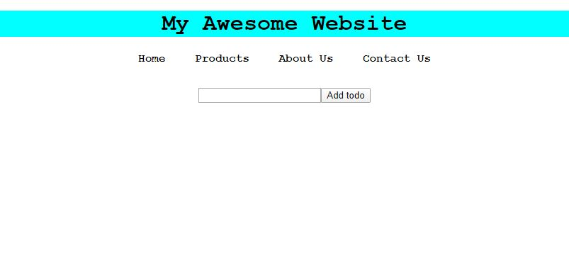

# javascript-dom-creation-3

In this exercise you are going to use vanilla javascript to create elements and manipulate the DOM.  All the HTML elements in this exercise are only allowed to be created using vanilla JavaScript.


### Before You Begin

Be sure to check out a new branch (**from master**) for this exercise. Detailed instructions can be found [**here**](../../guides/before-each-exercise.md).

### Quiz Questions
After completing this exercise, you should be able to discuss or answer the following questions:

1. Why is it important to be able to retrieve and use data from inputs?
2. Why is it dangerous to assume you have the correct data when creating elements?

### Exercise

1. There is no reading material in this exercise, it uses the same concepts you learned in your last few exercises. In the documentation list below I will include pages from _JavaScript and jQuery_ by Duckett just incase you need a refresher on concepts from previous exercises.


    [querySelector](https://developer.mozilla.org/en-US/docs/Web/API/Document/querySelector#Examples)

    [createElement](https://developer.mozilla.org/en-US/docs/Web/API/Document/createElement)
    pg. 222

    [appendChild](https://developer.mozilla.org/en-US/docs/Web/API/ParentNode/append#Examples)
    pg. 222

    [textContent](https://developer.mozilla.org/en-US/docs/Web/API/Node/textContent)
    pg. 216-217

    [className](https://developer.mozilla.org/en-US/docs/Web/API/Element/className)
    pg. 195, 232

    [setAttribute](https://developer.mozilla.org/en-US/docs/Web/API/Element/setAttribute)
    pg. 234

    [addEventListener](https://developer.mozilla.org/en-US/docs/Web/API/EventTarget/addEventListener)
    pg. 254, 277

1. Take a look at the `index.html` file for an overview on which classes you will be using.  The styling has been predefined for you since the goal in this exercise is to learn DOM manipulation and creation.

1. Take a look at the example gif below:

    <p align="center">
      
    </p>

    **Reminder:**

    **The goal of this exercise is to reach the example above using only vanilla javascript.  So please understand when I say things like _Create an `<h1>` HTML element_ in this exercise, I mean using vanilla JavaScript.**

1. Create a `<header>` HTML element.  This element will be used as the parent container for your header in this exercise.

1. Create an `<h1>` HTML element.

1. Add the following text node to the `<h1>` element:
    ```
    My Awesome Website
    ```

1. Add the class `heading` to the `<h1>` element.

1. Append the `<h1>` element to the `<header>` element you created earlier.

1. Create a `<ul>` element.  This element will be used as the parent container for your navbar in this exercise.

1. Add the class `navbar` to the `<ul>` element.

1. Create four `<li>` elements with the following text nodes:
   ```
   Home
   Products
   About Us
   Contact Us
   ```

1.  Append all four `<li>` elements you created to the `<ul>` element you created earlier.

1.  Append your `<ul>` element to the `<header>` element you created in the beginning.

1.  Append your `<header>`element to the `body`


1.  Your `index.html` should now look like this in the browser.

    <p align="center">
      
    </p>

1.  Create a `<div>` element.  This element will be used as the parent for your todo list.

1.  Add the class `todoListForm` to the `<div>`.

1.  Create a `<input>` element.

1.  Add an `id` of `todoInput` to the `<input>` element.

1.  Create a `<button>` element.

1.  Add the following text node to the `<button>` element.

    ```
    Add todo
    ```

1.  Add an `id` of `todoSubmit` to the `<button>` element.

1.  Create a `<ul>` element.  This element will serve as the parent element for your `<li>` elements you will create in the next exercise.

1.  Add a class of `todoList` to the to the `<ul>` element.

1.  Append the `<input>` element to the `<div>` you created earlier.

1.  Append the `<button` element to the `<div>` you created earlier.

1.  Append the `<ul>` element to the `<div>` you created earlier.

1.  Append the `<div>` element to the `body`

1.  Your `index.html` should now look like this:

    <p align="center">
      
    </p>

1.  Add an **event listener** to the Add todo `<button>` element.

1.  Your **event listener** should accomplish the following sub tasks:
    - Get the value from your `<input>` element.
    - Create an `<li>` element.
    - Add the input value as a text node to the `<li>` element.
    - Give the `<li>` element a class of `todo`.
    - Clear the input field
    - Append your `<li>` element to the `<ul>` element with the class of `todoList`.

1.  Go ahead and test your `index.html` in the browser, you should get the result below:

    <p align="center">
      
    </p>


### Submitting Your Solution

When your solution is complete, change directories to the root of your lessons repository. Then commit your changes, push, and submit a Pull Request on GitHub. Detailed instructions can be found [**here**](../../guides/after-each-exercise.md).
