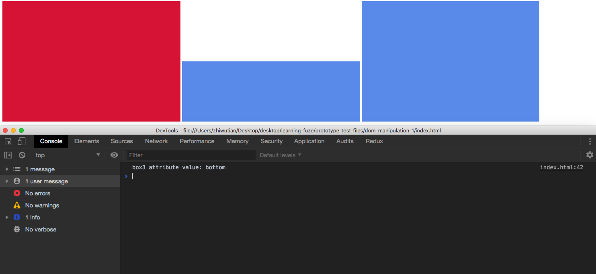

# JavaScript-Dom-Manipulation-1

One of the primary tasks of a JavaScript developer is manipulation of the DOM. Proper execution of DOM manipulation techniques allows the developer to create dynamic websites with content which is updated to reflect the wants and needs of the user.

Take a moment and think about changing the color scheme of a website to `dark mode`. It requires that numerous elements have their default colors changed or modified, something that could not be done without JavaScript manipulating the DOM.

In this exercise you are going to learn how to select elements on the DOM using JavaScript, and then how to modify the elements you have selected.

Let's get started!

### Before You Begin

Be sure to check out a new branch (**from master**) for this exercise. Detailed instructions can be found [**here**](../../guides/before-each-exercise.md).

### Exercise

1. Read pp. 184 - 195 in JavaScript and jQuery by Duckett.
2. Open the MDN documentation on the `getElementById()` method [**here**.](https://developer.mozilla.org/en-US/docs/Web/API/Document/getElementById)
3. Open the W3 Schools documentation on the `HTML DOM classList Property` [**here**.](https://www.w3schools.com/jsref/prop_element_classlist.asp)
4. Open the MDN documentation for the `HTMLElement.style` property [**here**.](https://developer.mozilla.org/en-US/docs/Web/API/HTMLElement/style)
5. Open the MDN documentation for the `Element.setAttribute()` method [**here**](https://developer.mozilla.org/en-US/docs/Web/API/Element/setAttribute)
6. Open the MDN documentation for the `Element.getAttribute()` method [**here**.](https://developer.mozilla.org/en-US/docs/Web/API/Element/getAttribute)
7. Now, create an `index.html` file in the `javascript-dom-manipulation-1` directory and prepare it for HTML, CSS, and Javascript.
8. Within the `index.html` file, do the following:
    - Create 3 div elements
        - Give each of them an `id`
            - `box1` for the 1st div.
            - `box2` for the 2nd div.
            - `box3` for the 3rd div.
        - Give them each a class named `blue`
    - Create the following CSS selectors in your CSS:
        - a `div` tag with the following CSS:
            - `display:inline-block`
            - `width:30%`
            - `height:300px`
        - a class named `blue` with the following CSS:
            - `background-color:cornflowerblue`
        - a class named `red` with the following CSS:
            - `background-color:crimson`
9. Open the code in your browser to confirm it looks like the example:
    

10. Now using `JavaScript`, complete the following:
    - Select the div with the id of `box1`, remove the `blue` class, and add the `red` class.
        - This will change the background color of `div1` to `crimson`
    - Select the div with the id of `box2`, and change its CSS Height property to `150px`.
        - This will change the height of the `box2` element to `150px`
    - Select the div with the id of `box3`, and give it a custom attribute named `position` with the value `bottom`.
    - Select the div with the id of `box3` again now that you have added the new `position` attribute, and store the value assigned to the `position` attribute in a new variable.
    - Finally, console log the variable in which you stored the `position` attribute value.
11. Run your code and confirm the output matches the following example:
    

12. When you have completed the above, make sure to include screenshots of your code output and the Chrome Dev Tools Console with your pull request.

### Submitting Your Solution

When your solution is complete, change directories to the root of your lessons repository. Then commit your changes, push, and submit a Pull Request on GitHub. Detailed instructions can be found [**here**](../../guides/after-each-exercise.md).

### Quiz

- What is the primary advantage to storing your selected elements in a variable?
- Why might you need JavaScript to modify the DOM after the page loads?
- How can you better prepare when writing HTML for DOM manipulation in your JavaScript code?
