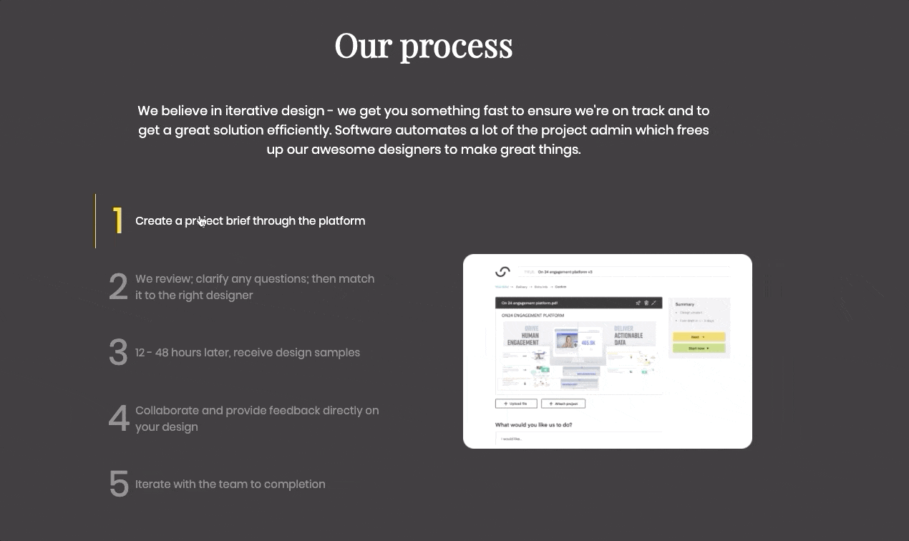

# javascript-dom-manipulation-challenge

Using HTML, CSS, and Javascript to build an interactive explanation of a company's process.

### Before You Begin

Be sure to check out a new branch (**from master**) for this exercise. Detailed instructions can be found [**here**](../../guides/before-each-exercise.md).

### Challenge

For this challenge, you will be using HTML, CSS, and Javascript to build a section of a company's website showcasing their development process. Here is an example of the final product:

<p align="middle">
  
</p>

Your implementation doesn't have to look absolutely identical to the reference image, but get as close as you can. It should be challenging to notice any differences. Necessary images have been provided in the `assets` folder.

You will need to create and link an HTML file, CSS file, and Javascript file in order to complete this challenge. You will also need to include the following `link` element in the `head` of your HTML document:

```html
<link href="https://fonts.googleapis.com/css2?family=Playfair+Display&family=Poppins:wght@400;600&display=swap" rel="stylesheet">
```

The above link element is including two font families from Google Fonts: "Playfair Display" and "Poppins". Please use "Playfair Display" for the main headline, and "Poppins" for all other text in the challenge.

Finally, there is a `grid.css` file provided for you to use as well for layout and sizing of your elements.

### Workflow

It is recommended that you build your implementation side-by-side with the reference image. Use your browser's developer tools to inspect elements and experiment with styles as you go.

### Useful HTML Elements

Here are **links** to documentation for HTML elements that you may find useful while completing the challenge.

- [`div`](https://developer.mozilla.org/en-US/docs/Web/HTML/Element/div)
- [`h1`](https://developer.mozilla.org/en-US/docs/Web/HTML/Element/Heading_Elements)
- [`p`](https://developer.mozilla.org/en-US/docs/Web/HTML/Element/p)
- [`span`](https://developer.mozilla.org/en-US/docs/Web/HTML/Element/span)
- [`img`](https://developer.mozilla.org/en-US/docs/Web/HTML/Element/img)

### CSS Properties, Selectors, Pseudo-classes

Here are **links** to some CSS topics that you may find useful while completing the challenge.

#### Properties

- [`width`](https://developer.mozilla.org/en-US/docs/Web/CSS/width)
- [`height`](https://developer.mozilla.org/en-US/docs/Web/CSS/height)
- [`padding`](https://developer.mozilla.org/en-US/docs/Web/CSS/padding)
- [`margin`](https://developer.mozilla.org/en-US/docs/Web/CSS/margin)
- [`border`](https://developer.mozilla.org/en-US/docs/Web/CSS/border)
- [`border-color`](https://developer.mozilla.org/en-US/docs/Web/CSS/border-color)
- [`cursor`](https://developer.mozilla.org/en-US/docs/Web/CSS/cursor)
- [`justify-content`](https://developer.mozilla.org/en-US/docs/Web/CSS/justify-content)
- [`align-items`](https://developer.mozilla.org/en-US/docs/Web/CSS/align-items)
- [`font-family`](https://developer.mozilla.org/en-US/docs/Web/CSS/font-family)
- [`font-size`](https://developer.mozilla.org/en-US/docs/Web/CSS/font-size)
- [`text-align`](https://developer.mozilla.org/en-US/docs/Web/CSS/text-align)
- [`color`](https://developer.mozilla.org/en-US/docs/Web/CSS/color)
- [`background-color`](https://developer.mozilla.org/en-US/docs/Web/CSS/background-color)

#### Selectors

- [Type Selector](https://developer.mozilla.org/en-US/docs/Web/CSS/Type_selectors)
- [Class Selector](https://developer.mozilla.org/en-US/docs/Web/CSS/Class_selectors)
- [Descendent Selector](https://developer.mozilla.org/en-US/docs/Web/CSS/Descendant_combinator)
- [Child Selector](https://developer.mozilla.org/en-US/docs/Web/CSS/Child_combinator)

### Useful Javascript Methods

Here are **links** to some Javascript methods that you may find useful while completing the challenge.

- [`querySelectorAll`](https://developer.mozilla.org/en-US/docs/Web/API/Document/querySelectorAll)
- [`querySelector`](https://developer.mozilla.org/en-US/docs/Web/API/Document/querySelector)
- [`addEventListener`](https://developer.mozilla.org/en-US/docs/Web/API/EventTarget/addEventListener)
- [`setAttribute`](https://developer.mozilla.org/en-US/docs/Web/API/Element/setAttribute)

### Submitting Your Solution

When your solution is complete, change directories to the root of your lessons repository. Then commit your changes, push, and submit a Pull Request on GitHub. Detailed instructions can be found [**here**](../../guides/after-each-exercise.md).
