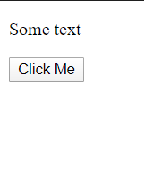
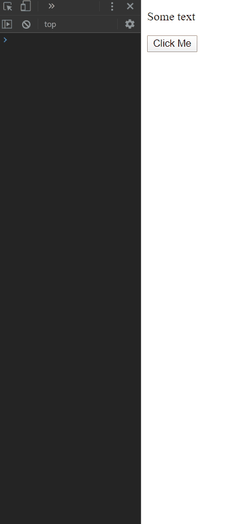
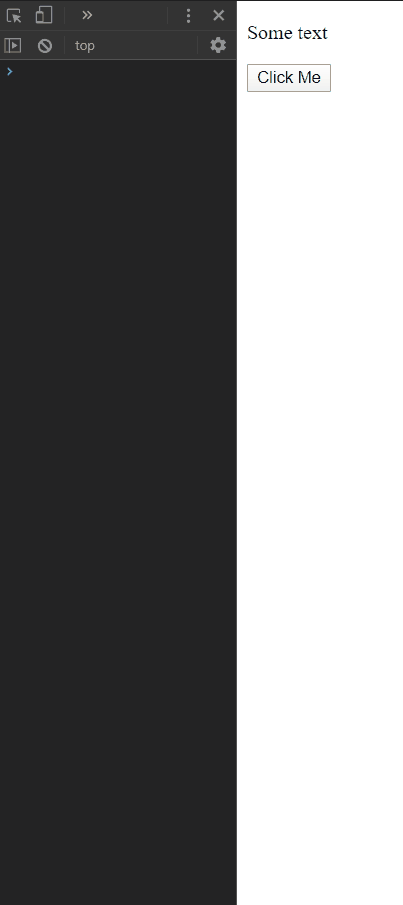

# javascript-event-bubbling

In this exercise you are going to use the event object to find the element that the user has clicked upon.


### Before You Begin

Be sure to check out a new branch (**from master**) for this exercise. Detailed instructions can be found [**here**](../../guides/before-each-exercise.md).

### Exercise

1. Read about event bubbling on pages 260 and 261 in _JavaScript and jQuery_ by Duckett.

1. Checkout these links to documentation:

    [event.target](https://developer.mozilla.org/en-US/docs/Web/API/Event/target)

    [event.currentTarget](https://developer.mozilla.org/en-US/docs/Web/API/Event/currentTarget)

1. Create an `index.html` and add a basic [HTML Skeleton](../html-skeleton/README.md).

1. Add a `<script>` tag at bottom of your `<body>` tag like so:

    ```html
      <body>
      <!-- your html goes here -->


      <script>
      //your javascript code goes here
      </script>
      </body>
    ```

    You may also create a `main.js` file and link it your `index.html` using a `<script>` tag.  However it must be linked at the bottom of the `<body>`.

1. Create an HTML `<div>` element with an `id` of container.

1. Create an HTML `<p>` element with some text inside of it as a child of the HTML `<div>` element with the `id` of container.

1. Create an HTML `<button>` element with a text node of "Click Me" as a child of the HTML `<div>` element with the `id` of container.

1. Open your `index.html` in your browser:

    <p align="center">
      
    </p>

    Moving to the Javascript now!

1. Add an **event listener** to the `<div>` element with the `id` of container.  Inside the callback function for the event listener accomplish the following tasks:
    - Log to the console "container clicked".
    - Log to the console the `currentTarget` property of the `event` object.
    - Log to the console the `target` property of the `event` object.

1.  Open up your console and play around with clicking different elements on the page.  Notice the how the `currentTarget` is always the same, but the `target` is different.  Why is that?

    <p align="center">
      
    </p>

1. Add an **event listener** to the `<button>` element.  Inside the callback function for the event listener accomplish the following tasks:
    - Log to the console "button clicked".
    - Log to the console the `currentTarget` property of the `event` object.
    - Log to the console the `target` property of the `event` object.
    - Make sure to label your logs properly to see the elements in the console.

    <p align="center">
      
    </p>

### Submitting Your Solution

When your solution is complete, change directories to the root of your lessons repository. Then commit your changes, push, and submit a Pull Request on GitHub. Detailed instructions can be found [**here**](../../guides/after-each-exercise.md).

### Quiz

- What is event bubbling?
- What is the difference between `event.target` and `event.currentTarget`.
