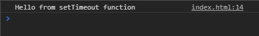
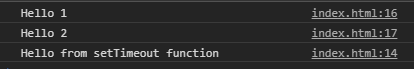
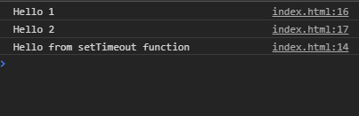

# javascript-event-loop

The event loop is one of the most important aspects to understand about JavaScript.

### Before You Begin

Be sure to check out a new branch (**from master**) for this exercise. Detailed instructions can be found [**here**](../../guides/before-each-exercise.md).

### Quiz Questions
After completing this exercise, you should be able to discuss or answer the following questions:

1. What is the event loop?
1. What does the term _blocking_ mean?
1. What is the call stack?


### Exercise


1. Create an `index.html` and add a basic [HTML Skeleton](../html-skeleton/README.md).

1. Add a `<script>` tag at bottom of your `<body>` tag like so:

    ```html
      <body>
      <!-- your html goes here -->


      <script>
      //your javascript code goes here
      </script>
      </body>
    ```
1. Call a `setTimeout` function with the two following arguments:
    - A callback function logging "Hello from setTimeout function" to the console.
    - The number 0

1.  Take a look at your console.

    <p align="center">
      
    </p>

    Nothing out of the ordinary right?

1. Log the two following strings to the console.
    -  `"Hello 1"`
    -  `"Hello 2"`

    Make sure to do this below the setTimeout function from earlier.

1. Take a look at your console.

    <p align="center">
      
    </p>

    This is might be your face right now.

    <p align="center">
      
    </p>


1. Use `setTimeout` to log the following string to the console, 2 seconds later:

    - `"Hello 2 seconds later"`

1. Using `setInterval` and `clearInterval`, log the following string to the console every 1 second, 5 times.

    - `"Intervals"`

1. Take a look at your console.

    <p align="center">
      
    </p>

1. [Watch this video.](https://www.youtube.com/watch?v=8aGhZQkoFbQ) Since the event loop will more than likely be an interview question someday, be sure to pay close attention!  This will also help solidify understanding what is happening in your code right now!

### Submitting Your Solution

When your solution is complete, change directories to the root of your lessons repository. Then commit your changes, push, and submit a Pull Request on GitHub. Detailed instructions can be found [**here**](../../guides/after-each-exercise.md).
