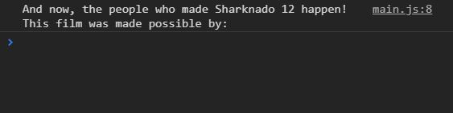
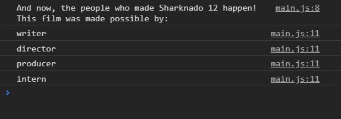
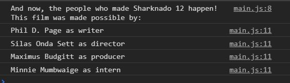

# javascript-for-in

By now you have used for loops to iterate through arrays.  But did you know there is a for loop dedicated to be used on objects as well?  Introducing the for in loop.  In this exercise we will have you iterate through an object that you will be creating.  Along with using console logs to get a grasp on what is happening in the background.  We will be treating our console as log for credits for the movie Sharknado!

### Before You Begin

Be sure to check out a new branch (**from master**) for this exercise. Detailed instructions can be found [**here**](../../guides/before-each-exercise.md).

### Quiz Questions
After completing this exercise, you should be able to discuss or answer the following questions:

1. What is a for in loop?
1. How do you target the value of a property in an object.
1. When should you use a for in loop?

### Exercise

1. Checkout these links to documentation about the for in loop:

    [MDN - for in](https://developer.mozilla.org/en-US/docs/Web/JavaScript/Reference/Statements/for...in)

    [W3 - for in](https://www.w3schools.com/jsref/jsref_forin.asp)

1. Create an `index.html` and add a basic [HTML Skeleton](../html-skeleton/README.md).

1. Create a `main.js` and add a `<script>` tag to your `index.html` with a path to the `main.js` file.

1. Create an **object literal** and assign it to a variable called `filmCredits`.

1. Create four properties inside the filmCredits object and assign them values based on the movie's creators.  For example:
    ```javascript
    writer: "Phil D. Page",
    director: "Silas Onda Sett",
    producer: "Maximus Budgitt",
    intern: "Minnie Mumbwaige"
    ```

1.  Log the following string to the console to introduce the credits

    ```
    'And now, the people who made Sharknado 12 happen! This film was made possible by:'
    ```

    Your console should now look like this:

    <p align="center">
      
    </p>

1. Create a **for in** loop to iterate through the object.  And log the keys to the console.


    <p align="center">
      
    </p>

1. Once you have the keys, you can use **bracket notation** and **string concatenation** to reach the following outcome in the console.

    <p align="center">
      
    </p>

### Submitting Your Solution

When your solution is complete, change directories to the root of your lessons repository. Then commit your changes, push, and submit a Pull Request on GitHub. Detailed instructions can be found [**here**](../../guides/after-each-exercise.md).
