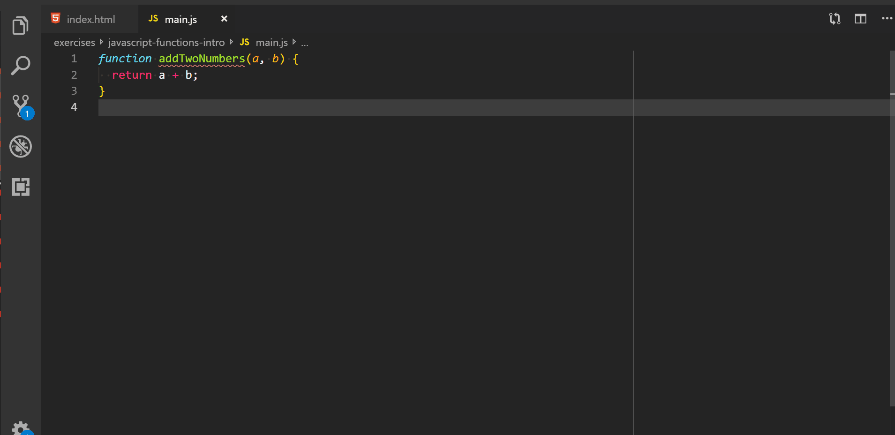

# javascript-functions-intro

A brief introduction to using functions in JavaScript.

### Before You Begin

Be sure to check out a new branch (**from master**) for this exercise. Detailed instructions can be found [**here**](../../guides/before-each-exercise.md).

### Quiz Questions
After completing this exercise, you should be able to discuss or answer the following questions:

1. What is a function?
1. Why are functions useful?
1. How do you call a function?
1. What are the parts of a function definition?
1. What is the difference between a parameter and an argument?


### Exercise

In this exercise you will be defining eleven **functions** in eleven sub-exercises.

1. Read about functions on pages 88 to 94 of _JavaScript and jQuery_ by Duckett.  On page 90 you will see this in an example code block:
    ```javascript
    document.write('Hello!')
    ```
    Please ignore that because we will be getting to DOM Manipulation later on.

1. A `index.html` and `main.js` has already been created and the first exercise has been completed to be used as an example.

1. Follow the instructions below to complete your exercises and remember to push your work to GitHub often.  Preferably after the completion of each sub-exercise.

### How to test your code

  Once you have completed your function.  Call your function after it was defined, and assign the return value to a variable.  Afterwards log that variable to the console.

  <p align="center">
      
    </p>

  We will start with the example exercise being explained.


### addTwoNumbers

1. Define a **function** named addTwoNumbers
1. This function takes two **parameters**
    - `a`: representing a number
    - `b`: representing a number
1. The purpose of this function is to add the **parameters** together and return the result.

    Example Input:
    ```javascript
    addTwoNumbers(2, 2)
    ```
    Expected Output:
    ```javascript
    4
    ```

### convertMinutesToSeconds

1. Define a **function** named convertMinutesToSeconds
1. This function takes one **parameter**
    - `number`: representing a number of minutes
1. The purpose of this function is to convert the **parameter** into seconds and return the result.

    Example Input:
    ```javascript
    convertMinutesToSeconds(2)
    ```
    Expected Output:
    ```javascript
    120
    ```

### greeting

1. Define a **function** named greeting
1. This function takes one **parameter**
    - `name`: representing a string
1. The purpose of this function is to concatenate the **parameter** to a phrase and return the result.

    Example Input:
    ```javascript
    greeting('Uzair')
    ```
    Expected Output:
    ```javascript
    "Hello Uzair!"
    ```

### typeOfData

1. Define a **function** named typeOfData
1. This function takes one **parameter**
    - `data`: representing any kind of data type.
1. The purpose of this function is to check the **parameter**'s data type and return the result.

    Example Input:
    ```javascript
    typeOfData(1072)
    ```
    Expected Output:
    ```javascript
    "number"
    ```

### multiplyTwoNumbers

1. Define a **function** named multiplyTwoNumbers
1. This function takes two **parameters**
    - `a`: representing a number
    - `b`: representing a number
1. The purpose of this function is to muliply the **parameters** together and return the result.

    Example Input:
    ```javascript
    multiplyTwoNumbers(10, 5)
    ```
    Expected Output:
    ```javascript
    50
    ```

### divideTwoNumbers

1. Define a **function** named divideTwoNumbers
1. This function takes two **parameters**
    - `a`: representing a number
    - `b`: representing a number
1. The purpose of this function is to divide the **parameters** and return the result.

    Example Input:
    ```javascript
    divideTwoNumbers(100, 5)
    ```
    Expected Output:
    ```javascript
    20
    ```

### subtractTwoNumbers

1. Define a **function** named subtractTwoNumbers
1. This function takes two **parameters**
    - `a`: representing a number
    - `b`: representing a number
1. The purpose of this function is to subtract the **parameters** and return the result.

    Example Input:
    ```javascript
    subtractTwoNumbers(22, 7)
    ```
    Expected Output:
    ```javascript
    15
    ```

### getArea

1. Define a **function** named getArea
1. This function takes two **parameters**
    - `width`: representing a number
    - `height`: representing a number
1. The purpose of this function is to use the **parameters** to find the area and return the result.

    Example Input:
    ```javascript
    getArea(17, 42)
    ```
    Expected Output:
    ```javascript
    714
    ```

### getFullname

1. Define a **function** named getFullname
1. This function takes two **parameters**
    - `firstName`: representing a string
    - `lastName`: representing a string
1. The purpose of this function is to use string concatenation with the **parameters** and return the result.

    Example Input:
    ```javascript
    getFullname("Mike", "Jenkins")
    ```
    Expected Output:
    ```javascript
    "Mike Jenkins"
    ```

### square

1. Define a **function** named square
1. This function takes one **parameter**
    - `number`: representing a number
1. The purpose of this function is to find the square of the **parameter** and return the result.

    Example Input:
    ```javascript
    square(5)
    ```
    Expected Output:
    ```javascript
    25
    ```

### lessThanOrEqualToZero

1. Define a **function** named lessThanOrEqualToZero
1. This function takes one **parameter**
    - `number`: representing a number
1. The purpose of this function is to check if the **parameter** is less than or equal to zero.  If it is less than or equal to 0 return `true`, otherwise return `false`.

    Example Input:
    ```javascript
    lessThanOrEqualToZero(5)
    ```
    Expected Output:
    ```javascript
    false
    ```


### Submitting Your Solution

When your solution is complete, change directories to the root of your lessons repository. Then commit your changes, push, and submit a Pull Request on GitHub. Detailed instructions can be found [**here**](../../guides/after-each-exercise.md).
