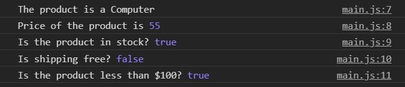
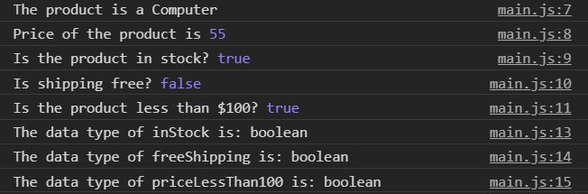
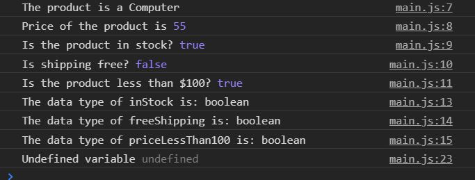
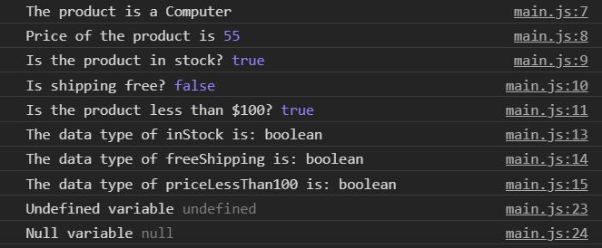
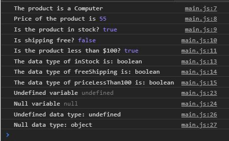

# javascript-primitive-booleans-undefined-null

A brief introduction to using booleans, undefined, and null in JavaScript.

### Before You Begin

Be sure to check out a new branch (**from master**) for this exercise. Detailed instructions can be found [**here**](../../guides/before-each-exercise.md).

### Exercise

In the **boolean** section of this exercise we will be declaring variables representing data of a computer on sale in an online store.

1. Read about booleans on page 66 of _JavaScript and jQuery_ by Duckett along with the _Boolean Data Type_ section of page 62.

1. Create an `index.html` and add a basic [HTML Skeleton](../html-skeleton/README.md).

1. Create a `main.js` and add a `<script>` tag to your `index.html` with a path to the `main.js` file.

1. Declare five variables storing the following five things about the product.
    - The product (a computer)
    - The price
    - If the product is in stock
    - If the product has free shipping
    - If the price is less than 100

    For the variable checking if the price is less than 100, you will need to use a **comparison operator** which you can read about on page 75 of _JavaScript and jQuery_ by Duckett in the section titled _Comparison Operators_.


1. Log your variables to the console with the appropriate labels.  If you are having trouble logging to the console feel free to checkout the [guide](../guides/logging-to-the-console.md)


1. Your console should look like the image below:
    <p align="center">
      
    </p>

1. Use `typeof` and log the types of variables that contain values of the boolean data type. You can find the documentation to `typeof` [here](https://developer.mozilla.org/en-US/docs/Web/JavaScript/Reference/Operators/typeof).

1. Your console should now look like the image below:
    <p align="center">
      
    </p>

    Booleans will play a very important part when we learn conditionals.

In this section we will give a small introduction to **undefined** and **null** in JavaScript.

1. Declare a variable, do not assign it a value, and log it to the console.

1. Your console should now look like the image below:
    <p align="center">
      
    </p>

    You will see `undefined` many times when you are debugging your code.  Undefined means that there was never a value assigned to the variable.  It usually means an unintentional abscence of value.  For more information on undefined feel free to checkout the documentation [here](https://developer.mozilla.org/en-US/docs/Web/JavaScript/Reference/Global_Objects/undefined)

    In the next example you will see the data type that is used to assign to a variable when the variable is needed to represent no value.  This data type is called `null`.

1. Declare a variable and assign the value `null` to it, and log it to the console.

1. Your console should now look like this:
    <p align="center">
      
    </p>

    You may be wondering the difference between `null` and `undefined`.  The short answer is that when you declare a variable without giving it any value,
    ```javascript
      var undefinedVariable;
    ```
    the data type of that variable is `undefined`.  `null` on the other hand must be assigned programmatically.
    ```javascript
      var nullVariable = null;
    ```
    It represents the absence of value and usually a variable that is null, will have a value later on in the program.  For more information on `null` please check it out in the documentation [here](https://developer.mozilla.org/en-US/docs/Web/JavaScript/Reference/Global_Objects/null)


1. Use `typeof` to log the data type of the `undefined` variable and `null` variable to the console.

1.  Your console should now look like this:
    <p align="center">
      
    </p>

    You can see that obviously the data type of `undefined` is undefined, but why is the data type of `null` an object?  Shouldn't it be `null`?  Be sure to bring this up during Q and A!

### Submitting Your Solution

When your solution is complete, change directories to the root of your lessons repository. Then commit your changes, push, and submit a Pull Request on GitHub. Detailed instructions can be found [**here**](../../guides/after-each-exercise.md).

### Quiz

- What is a boolean?
- What is a comparison operator?
- What is the difference between undefined and null?
