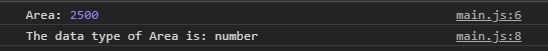
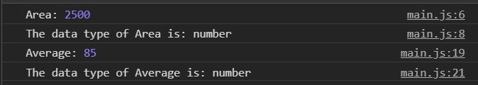
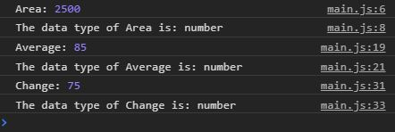

# javascript-primitive-numbers

A brief introduction to  numbers in JavaScript.

### Before You Begin

Be sure to check out a new branch (**from master**) for this exercise. Detailed instructions can be found [**here**](../../guides/before-each-exercise.md).

### Quiz Questions
After completing this exercise, you should be able to discuss or answer the following questions:

1. What is a number in JavaScript?
1. What is an arithmetic operator?
1. Name four of the arithmetic operators?
1. What is the order of execution?

### Exercise

1. Read about strings in pages 63, 76, and 77 of _JavaScript and jQuery_ by Duckett along with the _Numeric Data Type_ section of page 62.

1. Create an `index.html` and add a basic [HTML Skeleton](../html-skeleton/README.md).

1. Create a `main.js` and add a `<script>` tag to your `index.html` with a path to the `main.js` file.

1. Declare two variables containing numbers relative to:
    - height
    - width

1. Using the multiplication **operator** and the two variables you created, find the area, and assign it to a variable called area.

      For information on how to find the area please go [here.](https://www.mathsisfun.com/geometry/area.html)

1. Use `typeof` and log the type of the variable that has the area assigned to it to the console. You can find the documentation to `typeof` [here](https://developer.mozilla.org/en-US/docs/Web/JavaScript/Reference/Operators/typeof). If you are having trouble logging to the console feel free to checkout the [guide](../../guides/logging-to-the-console.md) .

1. Your console should look like the image below:
    

      
    

1. Declare three variables containing a number between 1 and 100 called:
    - studentGrade1
    - studentGrade2
    - studentGrade3

1. Using the addition and division **operators** and the three variables you created, find the average, and assign it to a variable called average.

    For information on how to find the average of three numbers, please go [here.](https://www.mathsisfun.com/mean.html)

1.  Log the average variable to the console along with the data type of the average variable using `typeof`.

1. Your console should now look like the image below:
    

      
    

1. Imagine you are in a restaurant, your requested payment is $25 and you only have a $100 bill.  Declare two variables containing the following:
    - The total amount requested
    - The total amount you paid

1. Using the subtraction **operator** and the two variables you created, find the change, and assign it to a variable called change.

    For information how to find change please go [here.](https://www.ducksters.com/money/making_change.php)

1.  Log the change variable to the console along with the data type of the change variable using `typeof`.

1. Your console should now look like this:
    

      
    

### Submitting Your Solution

When your solution is complete, change directories to the root of your lessons repository. Then commit your changes, push, and submit a Pull Request on GitHub. Detailed instructions can be found [**here**](../../guides/after-each-exercise.md).
