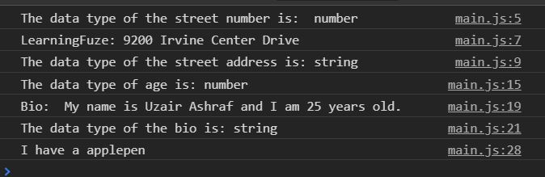

# javascript-primitive-strings

A brief introduction to using strings in JavaScript.

### Before You Begin

Be sure to check out a new branch (**from master**) for this exercise. Detailed instructions can be found [**here**](../../guides/before-each-exercise.md).

### Quiz Questions
After completing this exercise, you should be able to discuss or answer the following questions:

1. What is a string?
1. What is the string concatenation operator?
1. What is the difference when it comes to using single quotes or double quotes ( `' '` or `" "` )?
1. How do you `escape` quotation characters?
1. What is type coercion?

### Exercise

1. Read about strings in pages 64, 65, and 78 of _JavaScript and jQuery_ by Duckett along with the _String Data Type_ section of page 62.

1. Create an `index.html` and add a basic [HTML Skeleton](../html-skeleton/README.md).

1. Create an `main.js` and add a `<script>` tag to your `index.html` with a path to the `main.js` file.

1. Declare two `variables` storing the following two things about LearningFuze.
    - Street Number
    - Street Name

1. Use `typeof` and log the type of the variable that has the street number assigned to it to the console. You can find the documentation to `typeof` [here](https://developer.mozilla.org/en-US/docs/Web/JavaScript/Reference/Operators/typeof). If you are having trouble logging to the console feel free to checkout the [guide](../../guides/logging-to-the-console.md) .

1. Your console should look like the image below:
    

      
    

1. Declare a `variable` called address.

1. Join the street number and street name `variables` together using `string concatenation` and assign them to the `variable` address.

1.  Log the address `variable` to the console along with the data type of the address `variable` using `typeof`.
1. Your console should now look like the image below:
    

      
    

    Notice how the street number becomes a string after becoming concatenated with a string.  This is called Type Coercion.  When a number is added with a string, the end result is a string. Page 78 of _JavaScript and jQuery_ by Duckett has some examples.

1. Declare three variables and assign the following three things about you to them:
    - First Name
    - Last Name
    - Age

1.  Log the data type of age to the console similar to how you did previously.

1. Your console should now look like this:
    

      
    

1. Declare a `variable` called bio.

1. Use `string concatenation` and your three variables to write a small bio about yourself, and assign the value to the bio `variable`.  Afterwards log it to the console.

1. Use `typeof` to log the data type of the bio `variable` to the console.

1.  Your console should now look like this:
    

      
    

    This is another example of type coercion, using numbers concatenated with strings.  You can do this with strings alone as well.  Lets look at one more example.

1. Declare two variables and assign the following two random things to them.
    - A fruit
    - An item.

1. Concatenate them together and log them to the console.

1. Your console should look this:
    

      
    

### Submitting Your Solution

When your solution is complete, change directories to the root of your lessons repository. Then commit your changes, push, and submit a Pull Request on GitHub. Detailed instructions can be found [**here**](../../guides/after-each-exercise.md).
