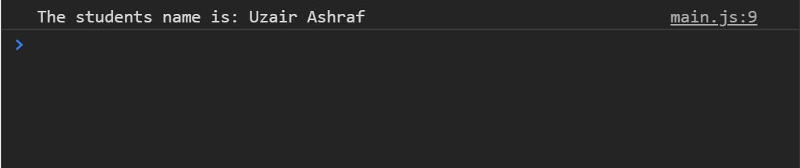
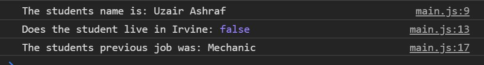
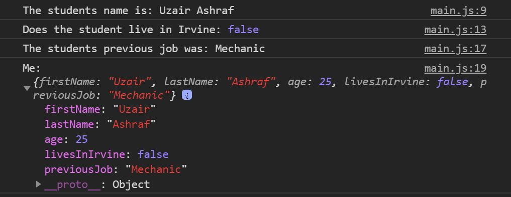
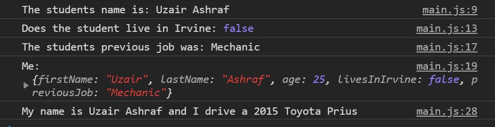
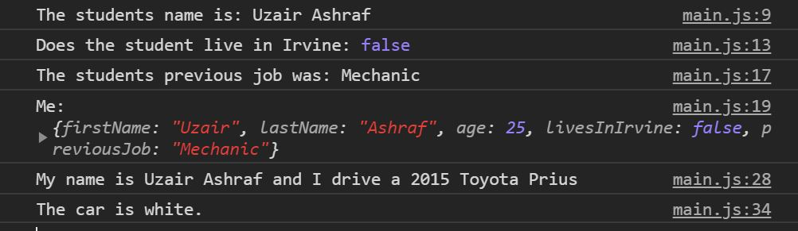
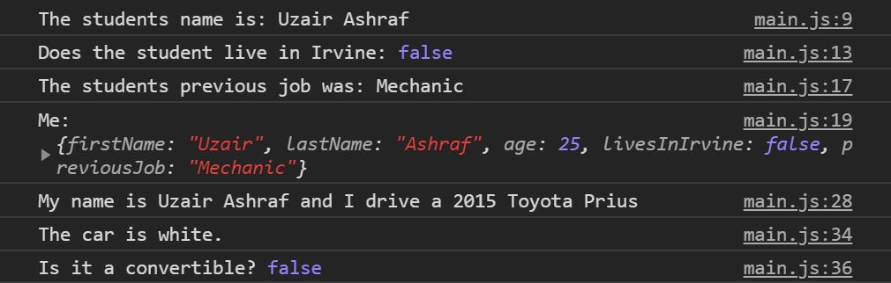
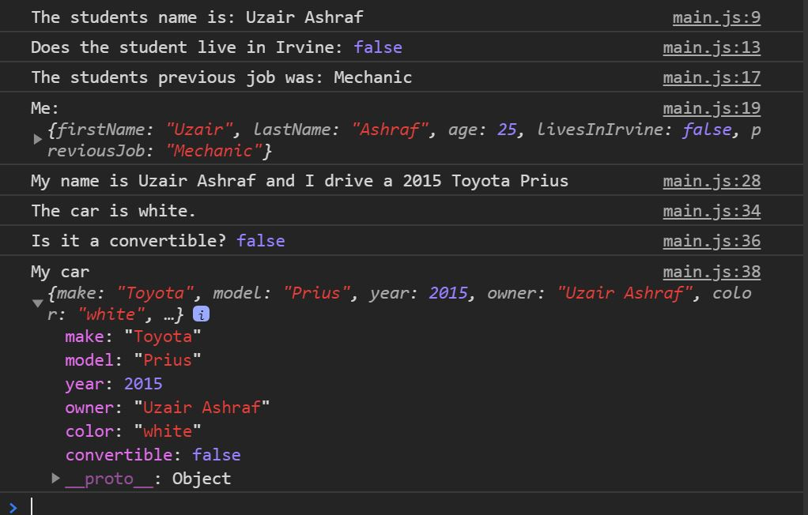

# javascript-reference-data-types-1

A brief introduction to using objects in JavaScript.

### Before You Begin

Be sure to check out a new branch (**from master**) for this exercise. Detailed instructions can be found [**here**](../../guides/before-each-exercise.md).

### Exercise

1. Read about objects in pages 100-105, 107, and 112 of _JavaScript and jQuery_ by Duckett.

1. Create an `index.html` and add a basic [HTML Skeleton](../html-skeleton/README.md).

1. Create a `main.js` and add a `<script>` tag to your `index.html` with a path to the `main.js` file.

1. Create an **object literal** and assign it to a variable called `student`.

1. Create three properties inside the student object and assign them values based on yourself.  For example:
    ```javascript
      firstName: "Uzair",
      lastName: "Ashraf",
      age: 25
    ```

1.  Use **dot notation** to access the `firstName` and `lastName` properties inside your object and form a string and assign it to a variable called `studentsName`.

1.  Log `studentsName` to the console with the appropriate label. If you are having trouble logging to the console feel free to checkout the [guide](../guides/logging-to-the-console.md).

    Your console should now look like this:

    <p align="center">
      
    </p>

1. Use **dot notation** to add a property to the student object called `livesInIrvine` and assign `true` or `false` to it depending on if you live in Irvine.

1. Log the `livesInIrvine` property to the console with the appropriate label.

    Your console should now look like this:

    <p align="center">
      
    </p>

1. Use **dot notation** to add a property to the student object called `previousJob` and assign a string to it pertaining to your previous job.

1. Log the `previousJob` property to the console with the appropriate label.

    Your console should now look like this:

    <p align="center">
      
    </p>

1. Log the `student` object to the console and have a look.

     <p align="center">
      
    </p>

    A huge part of the learning process is logging things to the console and understanding whats happening underneath.  You created an object literal and added properties to the object.  You can also modify properties and delete properties.  Before moving on to the next section of this exercise, add a couple more properties and try using the `delete` keyword as well.

1. Create an **object literal** and assign it to a variable called `myCar`.

1. Create three properties inside the `myCar` object and assign them values based on your car.  For example:
    ```javascript
      make: "Toyota",
      model: "Prius",
      year: 2015
    ```
    If you do not own a car, or remember your cars details, feel free to look one up online.

1.  Create another property inside the `myCar` object called `owner`, and assign the `studentsName` variable you created earlier to the property.

1. Use **bracket notation** to access properties inside the `myCar` object, form a sentence, and log it to the console.

    <p align="center">
      
    </p>

1. Use **bracket notation** to add a property to your `myCar` object called `color`, assign the color of your car to it, and log it to the console with the appropriate label.

    <p align="center">
      
    </p>

1. Use **bracket notation** to add a property to your `myCar` object called `convertible`, assign `true` or `false` depending on if your car is a convertible or not.  Afterwards log it to the console with the appropriate label.

    <p align="center">
      
    </p>

1.  Log `myCar` to the console and have a look.

    <p align="center">
      
    </p>

    Always remember to look around at the what you are creating.  It is the most crucial thing at this state of learning.


### Submitting Your Solution

When your solution is complete, change directories to the root of your lessons repository. Then commit your changes, push, and submit a Pull Request on GitHub. Detailed instructions can be found [**here**](../../guides/after-each-exercise.md).

### Quiz

- What is an object?
- How do you create an object literal?
- What is a property?
- When should you use bracket notation over dot notation?
- How do you remove a property in an object?
