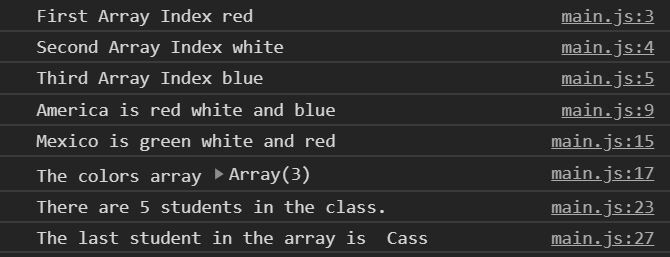

# javascript-reference-data-types-2

A brief introduction to using arrays in JavaScript.

### Before You Begin

Be sure to check out a new branch (**from master**) for this exercise. Detailed instructions can be found [**here**](../../guides/before-each-exercise.md).

### Quiz Questions
After completing this exercise, you should be able to discuss or answer the following questions:

1. What is an array in JavaScript?
1. How do you create an array literal?
1. What are the keys for the values inside an array?
1. Arrays have a property named length.  Because arrays have a properties, what other data structure are they similar to?

### Exercise

1. Read about objects in pages 70-73, and 118 of _JavaScript and jQuery_ by Duckett.

1. Create an `index.html` and add a basic [HTML Skeleton](../html-skeleton/README.md).

1. Create a `main.js` and add a `<script>` tag to your `index.html` with a path to the `main.js` file.

1. Create an **array literal** with three values `'red'`, `'white'`, and `'blue'` and assign the array to a variable called `colors`.  Make sure the order of the colors remains the same.

1. Log the first, second, and third values in the array, with proper labels.  If you are having trouble logging to the console feel free to checkout the [guide](../../guides/logging-to-the-console.md).

    

      
    

1.  By accessing the values in the `colors` array, create the sentence below, assign it to a variable named `sentence1` and log it to the console.

    

      
    

1.  In the `colors` array replace `'blue'` with `'green'`.

1.  By accessing the values in the `colors` array, form the sentence below, assign it to a variable named `sentence2` and log it to the console.

    

      
    

1.  Log the colors array to the console to have a look.

    

      
    

    Another reminder to always **look around you**.

1. Create an **array literal** with five values containing student names and assign it to a variable named `students`.

1. Get the size of the array by accessing the `length property` and assign it to a variable named `amountOfStudents`.

1. Create and log the sentence below to the console using the `amountOfStudents` variable.

    

      
    

    Notice how the `length property` gets the size of the array by counting from one. But when accessing areas in the array, you count from zero. Interesting right?

1. Using the variable `amountOfStudents` and the `students` array, access the last student in the array, assign the student to a variable named `lastStudentInArray`, and log the variable to the console.

    Remember the length property gets the size of the array by counting from one, and the indices of the array start from zero.

    

      
    

1. Finally, log the `student` array to the console, and have a look.

    

      
    

### Submitting Your Solution

When your solution is complete, change directories to the root of your lessons repository. Then commit your changes, push, and submit a Pull Request on GitHub. Detailed instructions can be found [**here**](../../guides/after-each-exercise.md).
