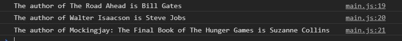
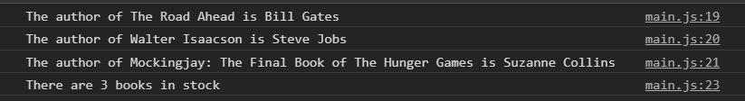
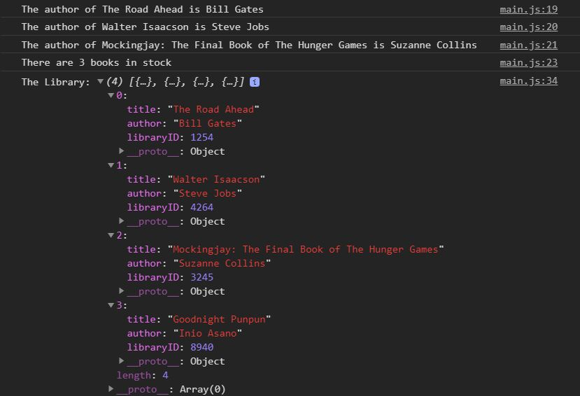

# javascript-reference-data-types-3

Using arrays and objects in JavaScript.

### Before You Begin

Be sure to check out a new branch (**from master**) for this exercise. Detailed instructions can be found [**here**](../../guides/before-each-exercise.md).

### Quiz Questions
After completing this exercise, you should be able to discuss or answer the following questions:

1. What are some good use cases for using objects inside arrays?


### Exercise

1. Read about objects and arrays on page 119 of _JavaScript and jQuery_ by Duckett.

1. Create an `index.html` and add a basic [HTML Skeleton](../html-skeleton/README.md).

1. Create a `main.js` and add a `<script>` tag to your `index.html` with a path to the `main.js` file.

1. Create an **array literal** which contains three objects that each represent books and assign the array to a variable called `library`.  The objects representing books should appear in a format like this

    ```javascript
    title: 'Javascript & jQuery',
    author: 'Jon Duckett',
    libraryID: 1234
    ```

    Feel free to choose any three books. The libraryID can be any random 4 digit number, just make sure they are unique.

1.  Log three sentences to the console using properties inside the objects inside the array.

    <p align="center">
      
    </p>

1. Using the `length` property of the array, create the following sentence and log it to the console:

    <p align="center">
      
    </p>

1. Create an **object literal** representing your favorite book and assign it to a variable named `book`.  Make sure to follow the same format as the other books.

1.  Using the [push](https://developer.mozilla.org/en-US/docs/Web/JavaScript/Reference/Global_Objects/Array/push) **method** add the `book` object to the `library` array.

1.  Log the `library` array to the console and make sure to have a look.

    <p align="center">
      
    </p>


### Submitting Your Solution

When your solution is complete, change directories to the root of your lessons repository. Then commit your changes, push, and submit a Pull Request on GitHub. Detailed instructions can be found [**here**](../../guides/after-each-exercise.md).
