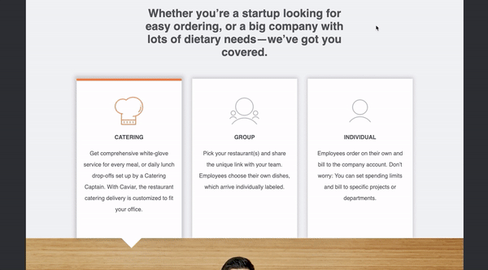

# javascript-tab-toggle-challenge

Using HTML, CSS, and Javascript to build an interactive graphic to toggle between services a company provides.

### Before You Begin

Be sure to check out a new branch (**from master**) for this exercise. Detailed instructions can be found [**here**](../../guides/before-each-exercise.md).

### Challenge

For this challenge, you will be using HTML, CSS, and Javascript to build a section of a company's website showcasing three different ways they offer their product. Here is an example of the final product:

  

Your implementation doesn't have to look absolutely identical to the reference image, but get as close as you can. It should be challenging to notice any differences. Necessary images have been provided in the `assets` folder. There is also a `grid.css` file provided for you to use for layout and sizing of your elements.

You will need to create and link an HTML file, CSS file, and Javascript file in order to complete this challenge.

Here are some important objectives to keep in mind as you work on this challenge:

1. When a tab is clicked, the icon changes to the "active" version, which is orange. When a tab is not currently "active", the icon should be grey.
1. When a tab is clicked, the image below it changes its source to match the appropriate image for the chosen tab.
1. When a tab is clicked, an indicator arrow emerges below the tab to point to the image below.
1. When a tab is clicked, an orange bar appears at the top of the element.
1. When a tab is clicked, the previously "active" tab is set to be not "active".
1. Each tab has a box shadow, which enlarges slightly when the tab is "active".
    - [Here](https://html-css-js.com/css/generator/box-shadow/) is a tool which you can use to generate the CSS for a box shadow to the specifications you like. **NOTE:** Tools like this are common in the development world, but don't be misled. If you choose to use a tool such as this, it is **EXTREMELY IMPORTANT** that you understand how the CSS property works as well, since your ability to complete a task should ***NEVER*** be dependent on a tool that does the job for you. The MDN documentation on the `box-shadow` property can be found [here](https://developer.mozilla.org/en-US/docs/Web/CSS/box-shadow), **make sure you understand how the property works**.
1. All text on the page is the font family "Helvetica".

### Workflow

It is recommended that you build your implementation side-by-side with the reference image. Use your browser's developer tools to inspect elements and experiment with styles as you go.

### Useful HTML References

Here are **links** to documentation for HTML elements that you may find useful while completing the challenge.

- [`div`](https://developer.mozilla.org/en-US/docs/Web/HTML/Element/div)
- [`h1`](https://developer.mozilla.org/en-US/docs/Web/HTML/Element/Heading_Elements)
- [`h4`](https://developer.mozilla.org/en-US/docs/Web/HTML/Element/Heading_Elements)
- [`p`](https://developer.mozilla.org/en-US/docs/Web/HTML/Element/p)
- [`img`](https://developer.mozilla.org/en-US/docs/Web/HTML/Element/img)
- [`data-*` Attributes](https://developer.mozilla.org/en-US/docs/Web/HTML/Global_attributes/data-*)

### CSS Properties, Selectors, Pseudo-classes

Here are **links** to some CSS topics that you may find useful while completing the challenge.

#### Properties

- [`width`](https://developer.mozilla.org/en-US/docs/Web/CSS/width)
- [`height`](https://developer.mozilla.org/en-US/docs/Web/CSS/height)
- [`padding`](https://developer.mozilla.org/en-US/docs/Web/CSS/padding)
- [`margin`](https://developer.mozilla.org/en-US/docs/Web/CSS/margin)
- [`border`](https://developer.mozilla.org/en-US/docs/Web/CSS/border)
- [`border-color`](https://developer.mozilla.org/en-US/docs/Web/CSS/border-color)
- [`cursor`](https://developer.mozilla.org/en-US/docs/Web/CSS/cursor)
- [`justify-content`](https://developer.mozilla.org/en-US/docs/Web/CSS/justify-content)
- [`align-items`](https://developer.mozilla.org/en-US/docs/Web/CSS/align-items)
- [`align-content`](https://developer.mozilla.org/en-US/docs/Web/CSS/align-content)
- [`font-family`](https://developer.mozilla.org/en-US/docs/Web/CSS/font-family)
- [`font-size`](https://developer.mozilla.org/en-US/docs/Web/CSS/font-size)
- [`text-align`](https://developer.mozilla.org/en-US/docs/Web/CSS/text-align)
- [`color`](https://developer.mozilla.org/en-US/docs/Web/CSS/color)
- [`background-color`](https://developer.mozilla.org/en-US/docs/Web/CSS/background-color)
- [`box-shadow`](https://developer.mozilla.org/en-US/docs/Web/CSS/box-shadow)
- [`position`](https://developer.mozilla.org/en-US/docs/Web/CSS/position)
- [`top`](https://developer.mozilla.org/en-US/docs/Web/CSS/top)
- [`bottom`](https://developer.mozilla.org/en-US/docs/Web/CSS/bottom)
- [`left`](https://developer.mozilla.org/en-US/docs/Web/CSS/left)
- [`right`](https://developer.mozilla.org/en-US/docs/Web/CSS/right)
- [`transition`](https://developer.mozilla.org/en-US/docs/Web/CSS/transition)
- [`transform`](https://developer.mozilla.org/en-US/docs/Web/SVG/Attribute/transform)
- [`line-height`](https://developer.mozilla.org/en-US/docs/Web/CSS/line-height)
- [`background-image`](https://developer.mozilla.org/en-US/docs/Web/CSS/background-image)
- [`background-position`](https://developer.mozilla.org/en-US/docs/Web/CSS/background-position)
- [`background-size`](https://developer.mozilla.org/en-US/docs/Web/CSS/background-size)

#### Selectors

- [Type Selector](https://developer.mozilla.org/en-US/docs/Web/CSS/Type_selectors)
- [Class Selector](https://developer.mozilla.org/en-US/docs/Web/CSS/Class_selectors)
- [Descendent Selector](https://developer.mozilla.org/en-US/docs/Web/CSS/Descendant_combinator)
- [Child Selector](https://developer.mozilla.org/en-US/docs/Web/CSS/Child_combinator)

### Useful Javascript References

Here are **links** to some Javascript methods that you may find useful while completing the challenge.

- [`querySelectorAll`](https://developer.mozilla.org/en-US/docs/Web/API/Document/querySelectorAll)
- [`querySelector`](https://developer.mozilla.org/en-US/docs/Web/API/Document/querySelector)
- [`addEventListener`](https://developer.mozilla.org/en-US/docs/Web/API/EventTarget/addEventListener)
- [`setAttribute`](https://developer.mozilla.org/en-US/docs/Web/API/Element/setAttribute)
- [`dataset`](https://developer.mozilla.org/en-US/docs/Web/API/HTMLOrForeignElement/dataset)

### Submitting Your Solution

When your solution is complete, change directories to the root of your lessons repository. Then commit your changes, push, and submit a Pull Request on GitHub. Detailed instructions can be found [**here**](../../guides/after-each-exercise.md).
