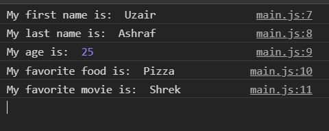

# javascript-variables

A brief introduction to using variables in JavaScript.

### Before You Begin

Be sure to check out a new branch (**from master**) for this exercise. Detailed instructions can be found [**here**](../../guides/before-each-exercise.md).

### Exercise

1. Read about variables in pages 58-61 of _JavaScript and jQuery_ by Duckett.
1. Review the example console screenshot below.
1. Create an `index.html` and add a basic [HTML Skeleton](../html-skeleton/README.md).
1. Create an `main.js` and add a `<script>` tag to your `index.html` with a path to the `main.js` file.
1. Create five variables storing the following five things about you and log them to the console:
  - First Name
  - Last Name
  - Age
  - Favorite Food
  - Favorite Movie

If you are having trouble logging to the console feel free to checkout the [guide](../../guides/logging-to-the-console.md)

  

### Submitting Your Solution

When your solution is complete, change directories to the root of your lessons repository. Then commit your changes, push, and submit a Pull Request on GitHub. Detailed instructions can be found [**here**](../../guides/after-each-exercise.md).

### Quiz

- What is a variable?
- Why are variables useful?
- What two special characters can a variable begin with?
- How do you declare a variable?
- How do you assign a value to a variable?
- Are variables case sensitive?
- Which words cannot be used as variable names?
