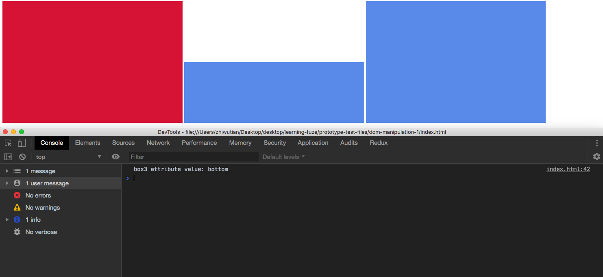

# jQuery-Dom-Manipulation-1

In this exercise you are going to notice that you have done the html portion in a previous exercise.  The purpose of this exercise is to display that anything you can do using jQuery, you can do with vanilla JavaScript.  That is because the jQuery library is created using vanilla JavaScript.

Let's get started!

### Before You Begin

Be sure to check out a new branch (**from master**) for this exercise. Detailed instructions can be found [**here**](../../guides/before-each-exercise.md).

### Exercise

1. Read about jQuery in 296, 320-323 in _JavaScript and jQuery_ by Duckett.
1. Create an `index.html` and add a basic [HTML Skeleton](../html-skeleton/README.md).

1. Add a `<script>` tag at bottom of your `<body>` tag like so:

    ```html
      <body>
      <!-- your html goes here -->


      <script>
      //your javascript code goes here
      </script>
      </body>
    ```

    You may also create a `main.js` file and link it your `index.html` using a `<script>` tag.  However it must be linked at the bottom of the `<body>`.

1. At the bottom of your `<body>` tag, before your own `<script>` tag, add a `<script>` tag with the jQuery CDN.

    ```html
      <body>
      <!-- your html goes here -->

      <script src="https://code.jquery.com/jquery-3.4.1.js"></script>
      <script>
      //your javascript code goes here
      </script>
      </body>
    ```
    For more information on linking the jQuery library to your application please read pages 354 and 355 in _JavaScript and jQuery_ by Duckett.

1. Within the `index.html` file, do the following:
    - Create 3 div elements
        - Give each of them an `id`
            - `box1` for the 1st div.
            - `box2` for the 2nd div.
            - `box3` for the 3rd div.
        - Give them each a class named `blue`
    - Create the following CSS selectors in your CSS:
        - a `div` tag with the following CSS:
            - `display:inline-block`
            - `width:30%`
            - `height:300px`
        - a class named `blue` with the following CSS:
            - `background-color:cornflowerblue`
        - a class named `red` with the following CSS:
            - `background-color:crimson`
9. Open the code in your browser to confirm it looks like the example:
    

10. Now using `jQuery`, complete the following:
    - Select the div with the id of `box1`, [remove the `blue` class](https://api.jquery.com/removeClass/), and [add the `red` class.](https://api.jquery.com/addClass/)
        - This will change the background color of `div1` to `crimson`
    - Select the div with the id of `box2`, and [change its CSS](https://api.jquery.com/css/) Height property to `150px`.
        - This will change the height of the `box2` element to `150px`
    - Select the div with the id of `box3`, and [give it a custom attribute](https://api.jquery.com/attr/) named `position` with the value `bottom`.
    - Select the div with the id of `box3` again now that you have added the new `position` attribute, and store the value assigned to the `position` attribute in a new variable.
    - Finally, console log the variable in which you stored the `position` attribute value.
11. Run your code and confirm the output matches the following example:
    

12. When you have completed the above, make sure to include screenshots of your code output and the Chrome Dev Tools Console with your pull request.


### Submitting Your Solution

When your solution is complete, change directories to the root of your lessons repository. Then commit your changes, push, and submit a Pull Request on GitHub. Detailed instructions can be found [**here**](../../guides/after-each-exercise.md).

### Quiz

- What is jQuery?
- What is the jQuery selector function?
- What does the jQuery selector function return?
- Why would someone use jQuery over vanilla Javascript?
- What are some downsides from using jQuery over vanilla Javascript?
- Why do we use the `<script>` tag at the bottom of the body, instead of putting it inside the `<head>` tag?
