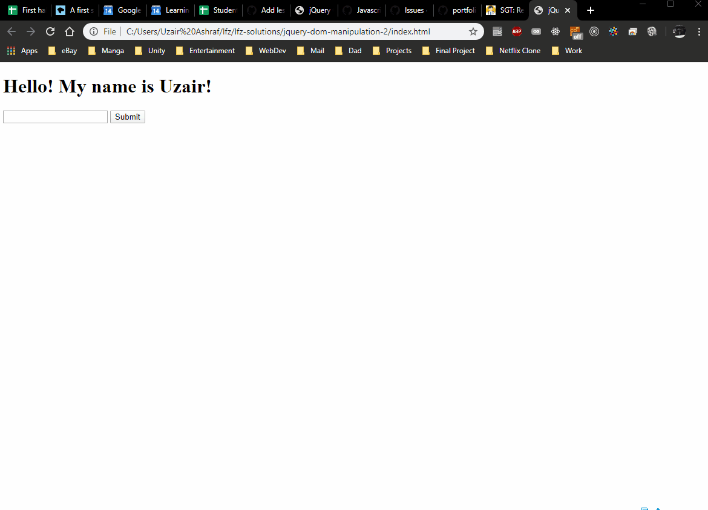

# jquery-dom-manipulation-2

An exercise involving jQuery and dom manipulation.

### Before You Begin

Be sure to check out a new branch (**from master**) for this exercise. Detailed instructions can be found [**here**](../../guides/before-each-exercise.md).

### Quiz Questions
After completing this exercise, you should be able to discuss or answer the following questions:

1. How do you get the text out of an HTML element?
1. How do you get the value out of an HTML input field?
1. What's the difference between `.text()` and `.html()`?
1. What does `.on()` do?

### Exercise

1. Read about jQuery in pages 314-317, 326, and 343 of _JavaScript and jQuery_ by Duckett.

1. Create an `index.html` and add a basic [HTML Skeleton](../html-skeleton/README.md).

1. Add a `<script>` tag at bottom of your `<body>` tag like so:

    ```html
      <body>
      <!-- your html goes here -->


      <script>
      //your javascript code goes here
      </script>
      </body>
    ```

    You may also create a `main.js` file and link it your `index.html` using a `<script>` tag.  However it must be linked at the bottom of the `<body>`.

1. At the bottom of your `<body>` tag, before your own `<script>` tag, add a `<script>` tag with the jQuery CDN.

    ```html
      <body>
      <!-- your html goes here -->

      <script src="https://code.jquery.com/jquery-3.4.1.js"></script>
      <script>
      //your javascript code goes here
      </script>
      </body>
    ```
    For more information on linking the jQuery library to your application please read pages 354 and 355 in _JavaScript and jQuery_ by Duckett.

1. Create an `<h1>` HTML element with following text node:
    ```
    Hello! My name is
    ```

1. Create an `<input>` HTML element.

1. Create a `<button>` HTML element with the following text node:
    ```
    Submit
    ```

1. Open your `index.html` file in your browser, it should look something like this:

    <p align="center">
      
    </p>

1.  In your `<script>` tag, using jQuery target the `<h1>` tag and concatenate your name to the text node in the html element.

    You may target the html elements in this exercise however you like.

1. Refresh/Open your `index.html` file and it should look something like this:

    <p align="center">
      
    </p>

1. Using the reading material, create the following outcome:

    <p align="center">
      
    </p>


    Make sure to clear your input field afterwards, like in the gif.

    Here are some links to documentation that can help you complete this exercise.

    [jQuery Selector Function](https://api.jquery.com/jQuery/)

    [Text Method](https://api.jquery.com/text/)

    [Val Method](https://api.jquery.com/val/)

    [On Method](https://api.jquery.com/on/)

    [Click Method](https://api.jquery.com/click/)


### Submitting Your Solution

When your solution is complete, change directories to the root of your lessons repository. Then commit your changes, push, and submit a Pull Request on GitHub. Detailed instructions can be found [**here**](../../guides/after-each-exercise.md).
