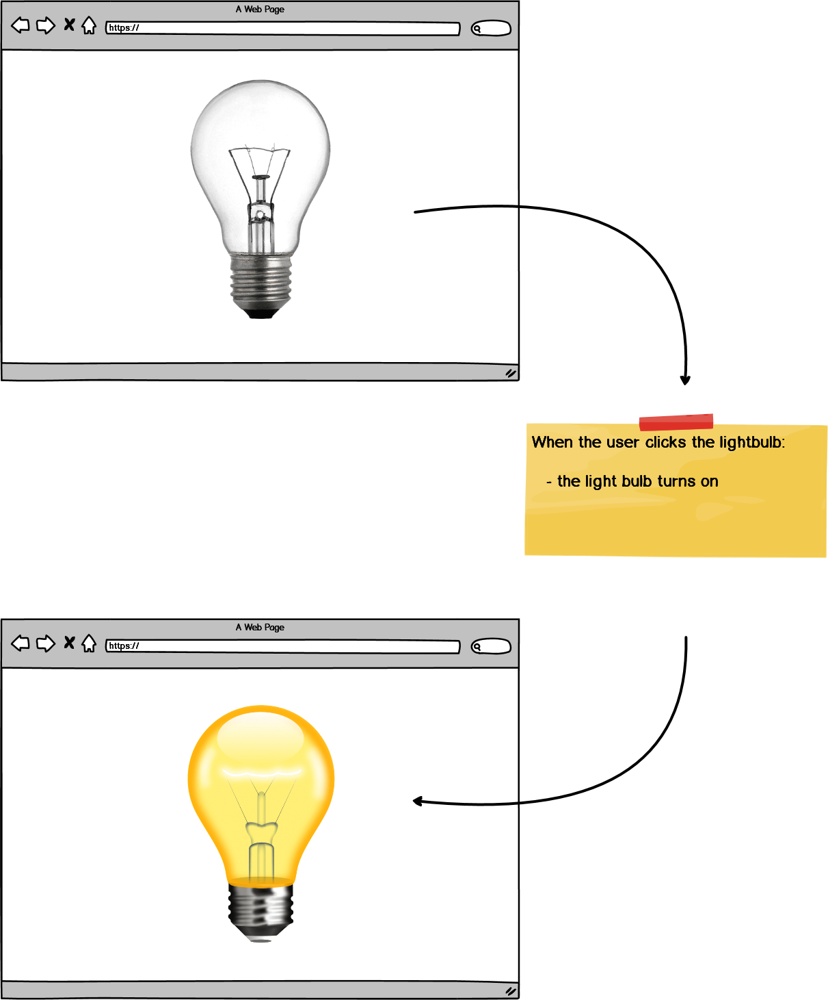
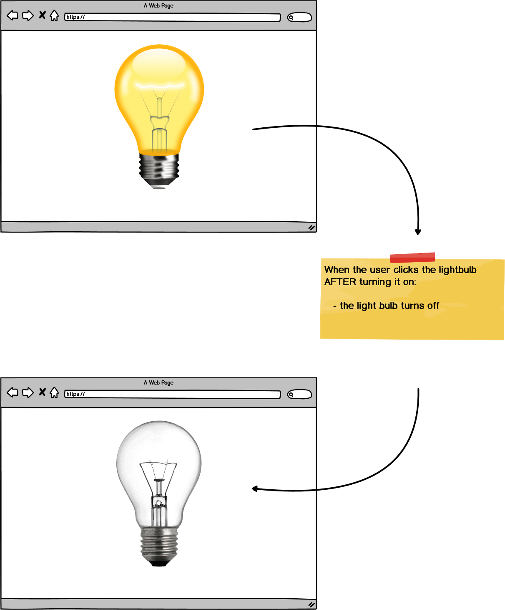

# lightbulb-challenge

Using HTML, CSS, and JavaScript to build a light bulb application

### Before You Begin

Be sure to check out a new branch (from `master`) for this exercise. Detailed instructions can be found [**here**](../../guides/before-each-exercise.md). Then navigate to the `exercises/lightbulb-challenge` directory in your terminal.

### Challenge

Use HTML, CSS, and JavaScript to create a `Light Bulb` application that can be turned on and off.

### Feature List

  - [User can turn on light bulb](#user-can-turn-on-light-bulb)
  - [User can turn off light bulb](#user-can-turn-off-light-bulb)

## Mockup

### User can turn on light bulb

___
### User can turn off light bulb

___

### References

- [querySelector](https://developer.mozilla.org/en-US/docs/Web/API/Document/querySelector)
- [addEventListener](https://developer.mozilla.org/en-US/docs/Web/API/EventTarget/addEventListener)
- [click event](https://developer.mozilla.org/en-US/docs/Web/API/Element/click_event)
- [classList](https://developer.mozilla.org/en-US/docs/Web/API/Element/classList)
- [className](https://developer.mozilla.org/en-US/docs/Web/API/Element/className)

### Submitting Your Solution

When your solution is complete, return to the root of your `lfz-lessons` directory. Then commit your changes, push, and submit a Pull Request on GitHub. Detailed instructions can be found [**here**](../../guides/after-each-exercise.md).
