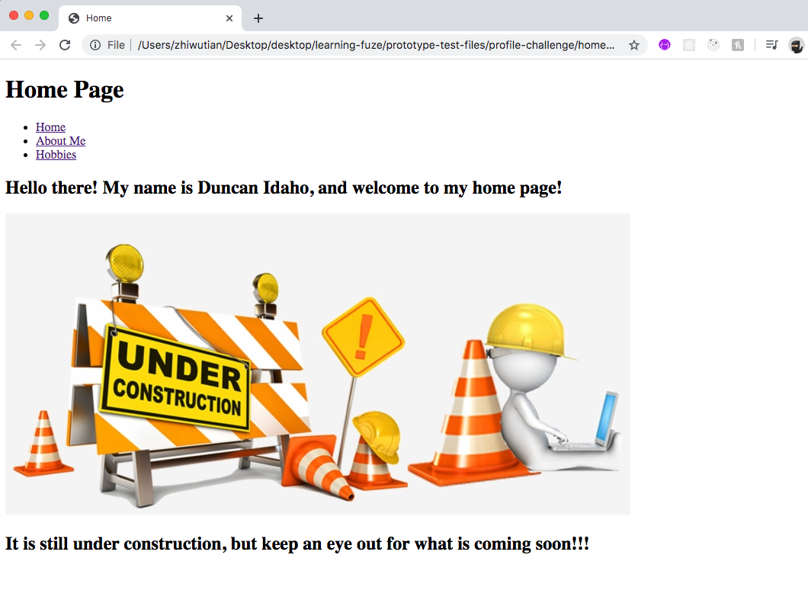
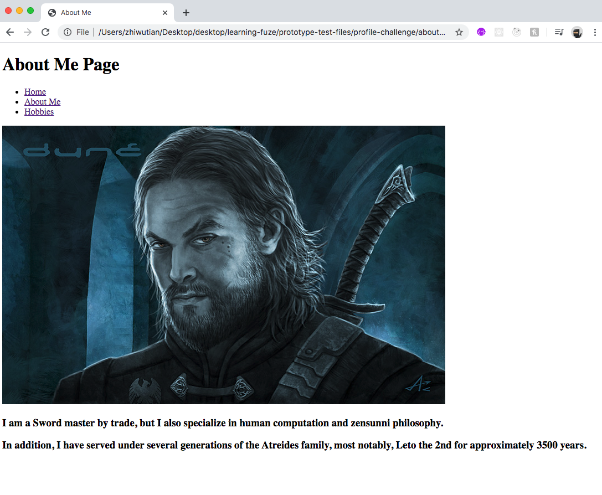
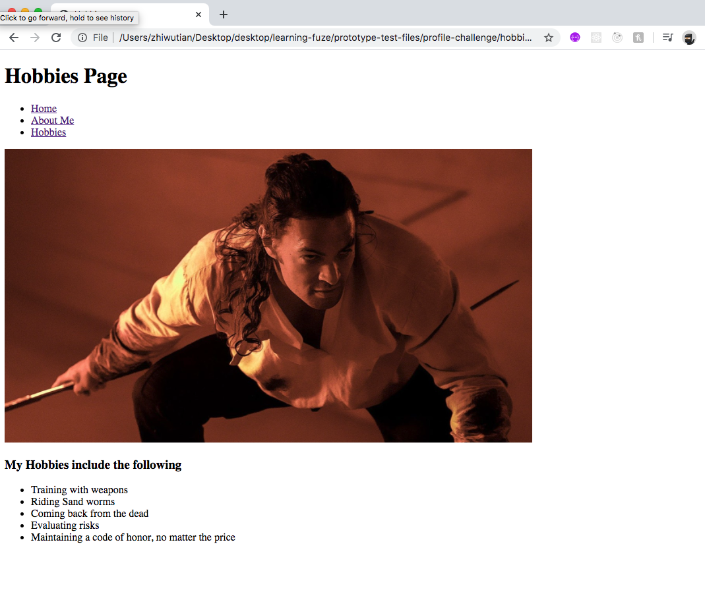

# mini-portfolio-challenge

In this challenge, you will be building a mini HTML portfolio with 3 separate HTML pages for a "character" of your choice.

### Before You Begin

Be sure to check out a new branch (**from master**) for this exercise. Detailed instructions can be found [**here**](../../guides/before-each-exercise.md).

### Exercise
1. You will be creating three files for this challenge:
    - `home.html`
    - `about-me.html`
    - `hobbies.html`

1. The first page you will be creating is the home page in a file named `home.html` , note the example below:

    

    Your home page must include the following:
    - A title
        - Home page
    - A navigation section
        - With links to:
            - Home
                - `home.html`
            - About Me
                - `about-me.html`
            - Hobbies
                - `hobbies.html`
    - A welcome statement
        - It should include the characters name
            - In this example it is `Duncan Idaho`
    - The under construction image
        - This is included in the `images` folder
    - a Statement about things still being under construction

1. The second page is the `about me` page which will be created in `about-me.html`, note the example below:

    

    Your home page must include the following:

    - A title
        - About Me Page
    - A navigation section
        - With links to:
            - Home
                - `home.html`
            - About Me
                - `about-me.html`
            - Hobbies
                - `hobbies.html`
    - An image of your chosen character
        - Find an image online!
    - A couple of statements about your character

1. The third page is the `hobbies` page which will be created in `hobbies.html`, note the example below:

    

    - A title
        - Hobbies Page
    - A navigation section
        - With links to:
            - Home
                - `home.html`
            - About Me
                - `about-me.html`
            - Hobbies
                - `hobbies.html`
    - Another image of your chosen character
        - Find an image online!
    - A list of hobbies which match the character.

1. When the above is completed, and you can correctly navigate between the 3 pages, congratulations, you did it!!! Move on to the `Submitting Your Solution` section below.

### Submitting Your Solution

When your solution is complete, change directories to the root of your lessons repository. Then commit your changes, push, and submit a Pull Request on GitHub. Detailed instructions can be found [**here**](../../guides/after-each-exercise.md).
