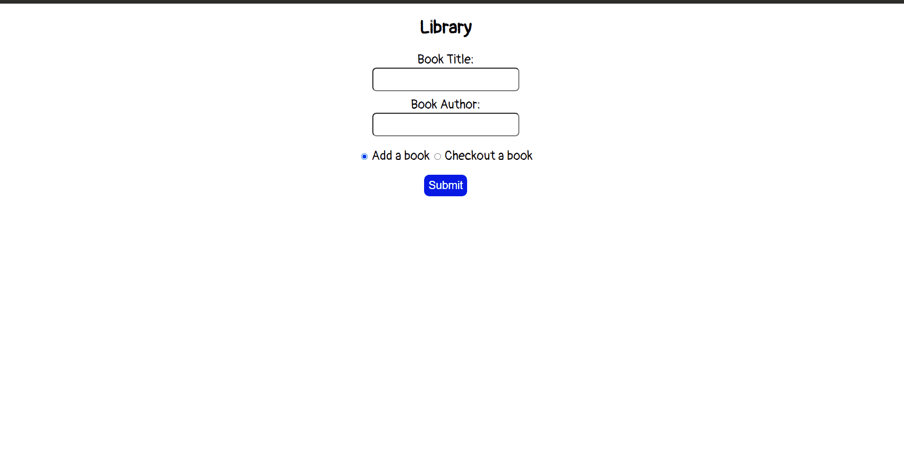
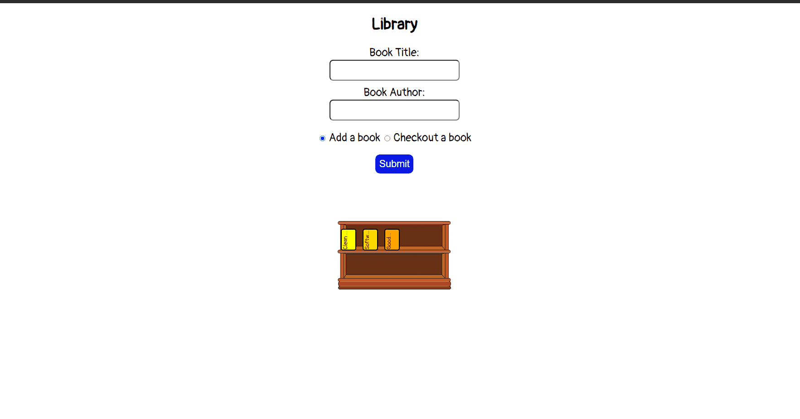
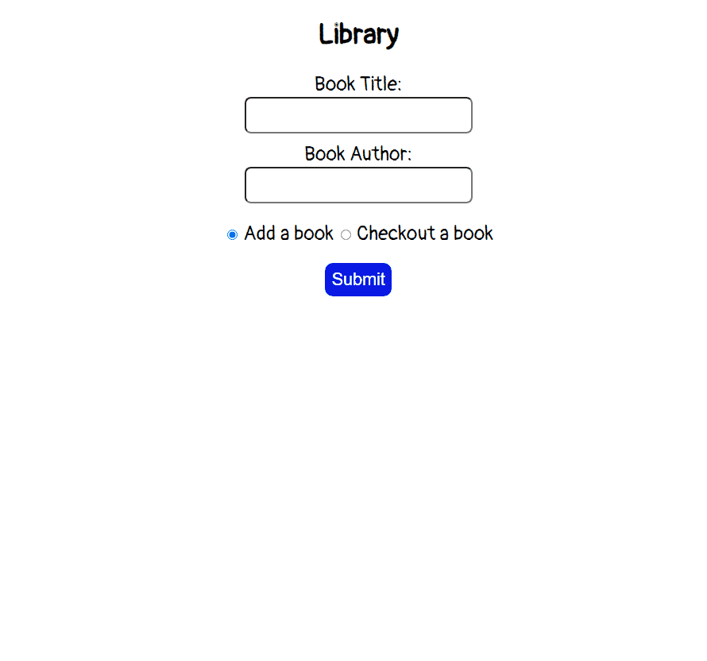

# oop-library-challenge

Using Object Oriented JavaScript to create a `Library` application.

### Before You Begin

Be sure to check out a new branch (from `master`) for this exercise. Detailed instructions can be found [**here**](../../guides/before-each-exercise.md). Then navigate to the `exercises/oop-library-challenge` directory in your terminal.

### Challenge

Use Object Oriented JavaScript to create a `Library` application that can add books, checkout books, and update the page to show the books.

All challenges done in oop may be accomplished in different ways.  The following are how we expect your application to be layed out, but of course your end solution may differ.  Be sure to question the differences in the solution provided after this challenge is given to you.

### Feature List

  - [User can add a book](#user-can-add-a-book)
  - [User can checkout a book](#user-can-checkout-a-book)
  - [User can see error message](#user-can-see-error-message)

## Mockup

### User can add a book

  When the user enters a book title and author and submits the form:

  - The page does not reload.
  - If there is no bookshelf present with available space, a new empty bookshelf is created.
  - The book is added to the shelf and its title is visible on the page.
  - The book has a random color.
  - The input fields of the form are reset.

  Take a look at your stylesheet in `css/style.css` for the classes that will help you accomplish this task.

### References

- [submit event](https://developer.mozilla.org/en-US/docs/Web/API/HTMLFormElement/submit_event)
- [Event.preventDefault()](https://developer.mozilla.org/en-US/docs/Web/API/Event/preventDefault)
- [FormData](https://developer.mozilla.org/en-US/docs/Web/API/FormData)
- [FormData.get()](https://developer.mozilla.org/en-US/docs/Web/API/FormData/get)
- [HTMLFormElement.reset()](https://developer.mozilla.org/en-US/docs/Web/API/HTMLFormElement/reset)
- [Document.querySelector()](https://developer.mozilla.org/en-US/docs/Web/API/Document/querySelector)
- [Document.createElement()](https://developer.mozilla.org/en-US/docs/Web/API/Document/createElement)
- [Element.className](https://developer.mozilla.org/en-US/docs/Web/API/Element/className)
- [Node.appendChild()](https://developer.mozilla.org/en-US/docs/Web/API/Node/appendChild)
- [style property](https://developer.mozilla.org/en-US/docs/Web/API/ElementCSSInlineStyle/style)
- [Math.floor()](https://developer.mozilla.org/en-US/docs/Web/JavaScript/Reference/Global_Objects/Math/floor)
- [Math.random()](https://developer.mozilla.org/en-US/docs/Web/JavaScript/Reference/Global_Objects/Math/random)
- [instanceOf](https://developer.mozilla.org/en-US/docs/Web/JavaScript/Reference/Operators/instanceof)

### User can checkout a book

  When the user enters a book title and author, selects the checkout a book radio button, and submits the form:

  - The book associated with the title and author will be removed from the shelf.
  - The page does not reload.
  - The input fields of the form are reset.

### References

- [submit event](https://developer.mozilla.org/en-US/docs/Web/API/HTMLFormElement/submit_event)
- [Event.preventDefault()](https://developer.mozilla.org/en-US/docs/Web/API/Event/preventDefault)
- [FormData](https://developer.mozilla.org/en-US/docs/Web/API/FormData)
- [FormData.get()](https://developer.mozilla.org/en-US/docs/Web/API/FormData/get)
- [HTMLFormElement.reset()](https://developer.mozilla.org/en-US/docs/Web/API/HTMLFormElement/reset)
- [ChildNode.remove()](https://developer.mozilla.org/en-US/docs/Web/API/ChildNode/remove)

### User can see error message

  This feature is completed when the following are accomplished:

  - When the user presses submit with empty fields, the user will see an error message stating the following: `Please enter a value`.
  - When the user selects the `checkout a book` radio button, enters a book title and author, and if there is no book associated with that title and author, the user will see an error message stating the following: `Sorry, we don't have any more (bookTitle) by (bookAuthor)`.
  - The error message appears for 1500 milliseconds and disappears.

### References

- [Document.querySelector()](https://developer.mozilla.org/en-US/docs/Web/API/Document/querySelector)
- [Node.textContent](https://developer.mozilla.org/en-US/docs/Web/API/Node/textContent)
- [Window.setTimeout()](https://developer.mozilla.org/en-US/docs/Web/API/WindowOrWorkerGlobalScope/setTimeout)

### Submitting Your Solution

When your solution is complete, return to the root of your `lfz-lessons` directory. Then commit your changes, push, and submit a Pull Request on GitHub. Detailed instructions can be found [**here**](../../guides/after-each-exercise.md).
