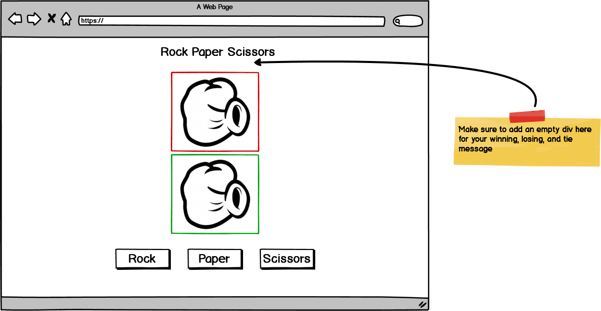
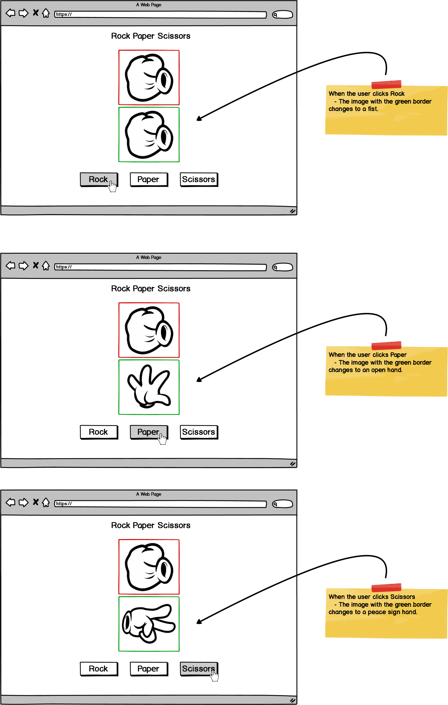
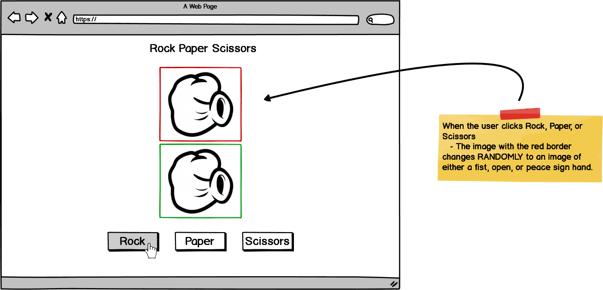
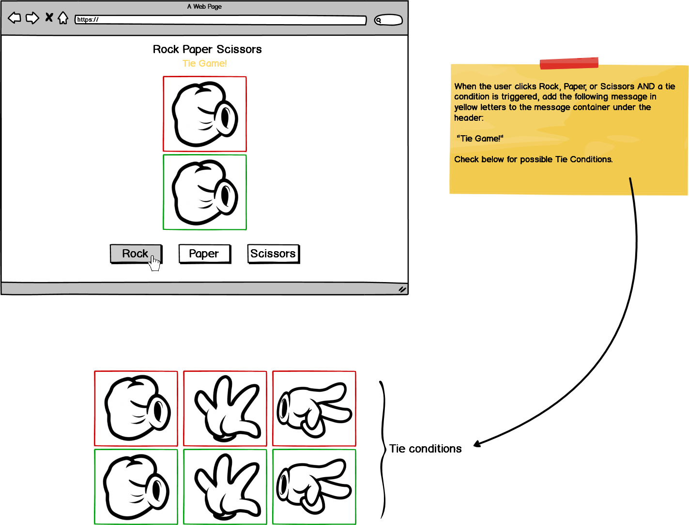
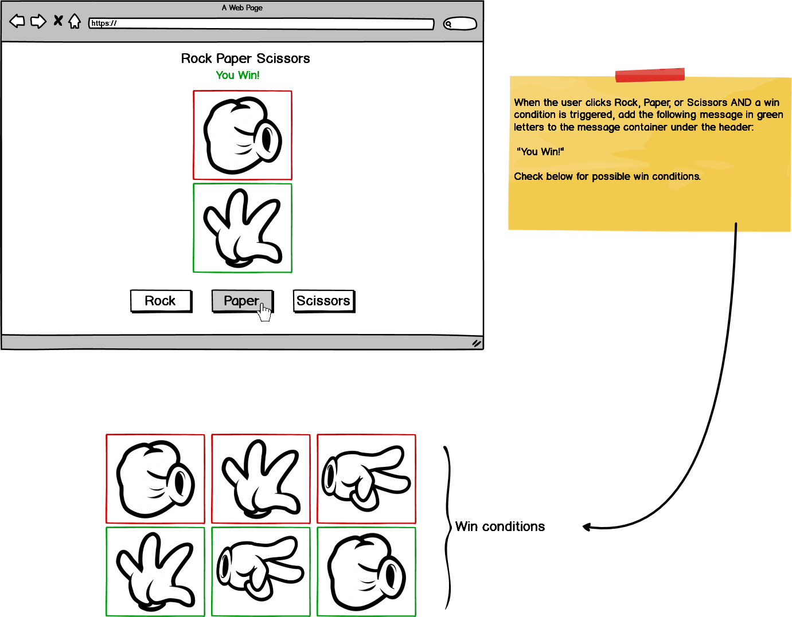
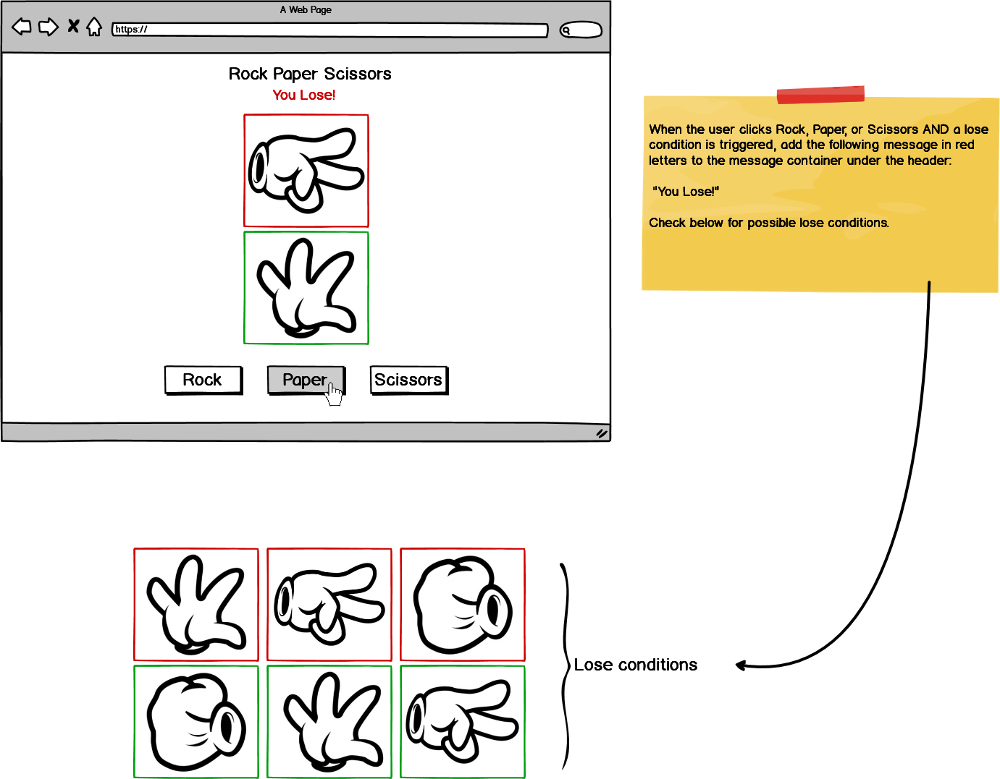

# rock-paper-scissors-challenge

Using HTML, CSS, and JavaScript to build a rock paper scissors application.

### Before You Begin

Be sure to check out a new branch (from `master`) for this exercise. Detailed instructions can be found [**here**](../../guides/before-each-exercise.md). Then navigate to the `exercises/rock-paper-scissors-challenge` directory in your terminal.

### Challenge

Use HTML, CSS, and JavaScript to create a `Rock Paper Scissors` application that can be tied, won, and lost.

### Feature List

  - [User can view game](#user-can-view-game)
  - [User can select action](#user-can-select-action)
  - [User can generate enemy action](#user-can-generate-enemy-action)
  - [User can tie game](#user-can-tie-game)
  - [User can win game](#user-can-win-game)
  - [User can lose game](#user-can-lose-game)

## Mockup

### User can view game

___
### User can select action

___
### User can generate enemy action

___
### User can tie game

___
### User can win game

___
### User can lose game

___
### References

- [querySelector](https://developer.mozilla.org/en-US/docs/Web/API/Document/querySelector)
- [addEventListener](https://developer.mozilla.org/en-US/docs/Web/API/EventTarget/addEventListener)
- [Math.floor](https://developer.mozilla.org/en-US/docs/Web/JavaScript/Reference/Global_Objects/Math/floor)
- [Math.random](https://developer.mozilla.org/en-US/docs/Web/JavaScript/Reference/Global_Objects/Math/random)
- [click event](https://developer.mozilla.org/en-US/docs/Web/API/Element/click_event)
- [classList](https://developer.mozilla.org/en-US/docs/Web/API/Element/classList)
- [className](https://developer.mozilla.org/en-US/docs/Web/API/Element/className)
- [tagName](https://developer.mozilla.org/en-US/docs/Web/API/Element/tagName)

### Submitting Your Solution

When your solution is complete, return to the root of your `lfz-lessons` directory. Then commit your changes, push, and submit a Pull Request on GitHub. Detailed instructions can be found [**here**](../../guides/after-each-exercise.md).
