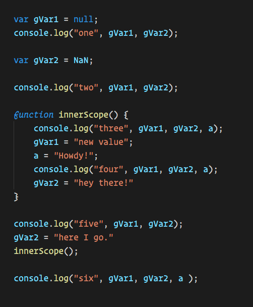

# scope-challenge-3

A JavaScript scope challenge.

### Before You Begin

Be sure to check out a new branch (**from master**) for this exercise. Detailed instructions can be found [**here**](../../guides/before-each-exercise.md).

### Exercise

1. Have a look at the code snippet below:




1. Based on the code snippet above, create a `main.js` file, and place comments in it which show the order of the console logs and the variable values during run time.
    - For example:
    ```javascript
    // "one" null undefined
    // "two" undefined object
    // "five" 27 "hi there"
    ```
1. When you have the order of all console logs and the associated variable values, move on to the `Submitting Your Solution` section below!


### Submitting Your Solution

When your solution is complete, change directories to the root of your lessons repository. Then commit your changes, push, and submit a Pull Request on GitHub. Detailed instructions can be found [**here**](../../guides/after-each-exercise.md).
